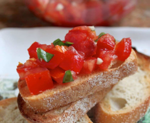

## Bruschetta

[Original Recipe by Christinna Conte](https://www.christinascucina.com/bruschettaill-even-tell-you-how-to/)

### 1. Classic Bruschetta

** Prep time: 10 minutes || Total time: 10 minutes || Serving: 3-4 || Rating X/10 **

** Ingredients **

- 3 medium sized tomatoes
- 3 medium sized cloves of fresh garlic
- 2 or 3 leaves of fresh basil
- 2 tablespoon extra virgin olive oil
- about 1/4 tsp sea salt (you can always add more)
- slices of toast, use a rustic, crusty Italian loaf, ciabatta or a baguette

Note: Bruschetta needs to have fresh ingredients to taste good. 

** Instructions **

1. Dice the tomatoes into small cubes and put into a medium sized bowl.
2. Next, finely mince the garlic. Add the garlic to the tomatoes.
3. Chop one or two large basil leaves into little pieces and place all 3 ingredients into a bowl.
4. Add the extra virgin olive oil and Kosher or sea salt, to taste. 

### 2. Balsamic Bruschetta

** Prep time: 10 minutes || Total time: 10 minutes || Serving: 8 || Rating X/10 **

** Ingredients **

- 8 tomatoes, diced
- 1/3 cup chopped fresh basil
- 1/4 cup Parmesan cheese, grated
- 2 cloves garlic, minced
- 1 tablespoon balsamic vinegar
- 1 teaspoon olive oil
- 1/4 teaspoon kosher salt
- 1/4 teaspoon freshly ground black pepper
- 1 loaf French bread, toasted and sliced (Italian loaf, ciabatta, baguette, or bagel)

** Instructions **

1. In a bowl, toss together the tomatoes, basil, Parmesan cheese, and garlic. 
2. Mix in the balsamic vinegar, olive oil, kosher salt, and pepper. 
3. Serve on toasted bread slices.

### 3. Guacamole Bruschetta

** Prep time: 10 minutes || Bake time: 10 minutes || Serving: 8 || Rating 10/10 **

** Ingredients **

- Guacamole: 
	- 3 avocados, pitted, diced
	- 2 tomatoes, diced
	- 1/2 cup sweet onion, diced
	- 1 teaspoon minced garlic
	- 1 lime juiced
	- 1 teaspoon salt
	- 1 teaspoon black pepper
	- 3 tablespoons chopped fresh cilantro (Optional)
	- 1 pinch ground cayenne pepper (Optional)
- Parmesan cheese, grated
- 1 loaf French bread, toasted and sliced (Italian loaf, ciabatta, baguette, or bagel)

** Instructions **

1. In a bowl, toss together the guacamole. 
2. Loaded the guacamole on top of the toasted bread. Add Parmesan cheese on top.
3. Broil the bruschetta at 350F for 5 minutes or until cheese have melt.

