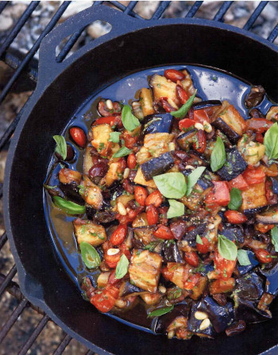

## Eggplant Caponata

[Original Recipe from Earth to Table Cookbook by Crump and Schormann]

** Prep time: 30 minutes + Overnight || Cook time: 1h30 minutes || Serving: 12-16 || Rating 10/10 **

### Ingredients

- 2 large eggplant, cut into 1-inch (25-mm), cubes
- 2 tablespoon kosher salt
- 1 1/2 cup olive oil (not extra-virgin)
- 6 stalks celery, cut into 1/2-inch (12-mm), diced
- 1/2 cup bulb fennel, cut into 1/2-inch (12-mm), diced
- 1 zucchini, cut into 1/2-inch (12-mm), diced
- 2 clove garlic, minced
- 1 medium onion, cut into 1/2-inch (12-mm), diced
- 3 medium tomatoes, cut into 1/2-inch (12-mm), diced
- 1 cup green olives (your favorite variety will be perfect), pitted and coarsely chopped
- 1/2 cup drained capers
- 1/2 cup raisins
- 1/2 cup white wine vinegar
- 2 tablespoon sweetener (maple syrup or honey or cane sugar)
- Salt and freshly ground black pepper
- 1/2 cup pine nuts, lightly toasted
- 3/4 cup whole raw almonds, lightly toasted
- 1/2 cup minced basil leaves 
- Breads or crackers to spread the eggplant caponata on

### Instructions

1. Add the eggplant in a bowl and cover with salty water (it have a sea taste). Let it sit in for an hour. 
2. Rinse well and pat dry with paper towels.
3. In a large, deep pot, heat 1 cup of oil over medium heat until hot but not smoking. Add celery and fennel; sauté for 1 minute. Add zucchini and sauté for 3 minutes. Add eggplants and sauté until vegetables are golden brown and tender, about 10 minutes. 
4. Using a slotted spoon, transfer vegetables to a plate lined with paper towel; set aside. Keep the oil in the pan. 
5. Add the remaining oil to the pot and sauté onions over medium heat until golden, about minutes.
6. Then add the garlic and sauté for 30 seconds. 
7. Stir in tomatoes, olives, capers, raisins, pine nuts, vinegar and sugar; cook for 10 minutes. 
8. Add the vegetables that been put aside and cook, stirring occasionally, for 10 minutes. 
9. Season to taste with salt and pepper.
10. Transfer to a wide, shallow dish and let cook for 1 hour. Cover and refrigerate for at least 8 hours.

Spread the eggplant caponata on breads or crackers!
