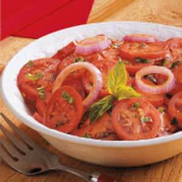

## Balsamic Tomato Slices

** Prep time: 5 minutes || Serving: 4 || Rating 9.5/10 **

### Ingredients

- 2 tomatoes, slices
- Balsamic vinegar
- Extra-virgin olive oil 
- Salt and Pepper

### Instructions

1. Toss carefully all the ingredients together. Adjust the seasoning to taste. 

Enjoy
