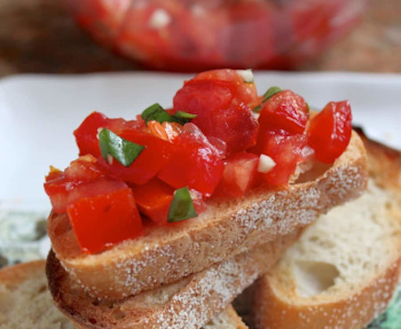

## Bruschetta

[Original Recipe by Christinna Conte](https://www.christinascucina.com/bruschettaill-even-tell-you-how-to/)

** Prep time: 10 minutes || Total time: 10 minutes || Serving: 3-4 || Rating X/10 **

### Ingredients

- 2 or 3 medium sized tomatoes, preferably organic, heirloom or homegrown
- 3 medium sized cloves of fresh garlic
- 2 or 3 leaves of fresh basil
- 1 1/2 to 2 tbsp extra virgin olive oil
- about 1/4 tsp sea salt (you can always add more)
- slices of toast, use a rustic, crusty Italian loaf, ciabatta or a baguette

Note: Bruschetta needs to have fresh ingredients to taste good. 

### Instructions

1. Dice the tomatoes into small cubes and put into a medium sized bowl.
2. Next, finely mince the garlic. Add the garlic to the tomatoes.
3. Chop one or two large basil leaves into little pieces and place all 3 ingredients into a bowl.
4. Add a the extra virgin olive oil and Kosher or sea salt, to taste. 
5. Mix well, and if it doesn't taste wonderful, you probably need to add more salt. 

Top the bread with the lovely tomato mixture and enjoy!
