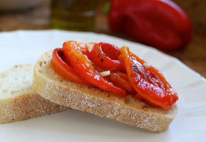

## Italian Style Roasted Red Pepper Antipasto

[Original Recipe by Christinna Conte](https://www.christinascucina.com/italian-style-roasted-red-pepper-antipasto-salad-and-crostini/)

** Prep time: 25 minutes || Cook time: 20 minutes || Serving: 4 || Rating X/10 **

### Ingredients

- 2 or 3 roasted red peppers, peeled and deseeded
- 1 or 2 cloves fresh garlic, minced
- 2 or 3 tbsp good quality extra virgin olive oil
- 1/2 tsp or more sea salt or Kosher salt
- 2 shakes of dried oregano

### Instructions

1. Roast the red peppers at 400F for about 20 minutes, flipping after roasting 10 minutes.
2. Place the peppers into a bowl, and cover tightly with plastic wrap. Allow the peppers to steam for 10 minutes.
3. Remove the skins from the peppers. 
2. Slice the peppers into strips, and place in a bowl.
3. Add the garlic, extra virgin olive oil, salt and oregano, and mix well.

Note: 

- Make this a few hours before you'd like to serve it so the flavors have time to develop. Use on an antipasto plate, as a side dish, on crostini or a baguette, or in a sandwich.
- Keep refrigerated, but bring to room temperature before serving.
