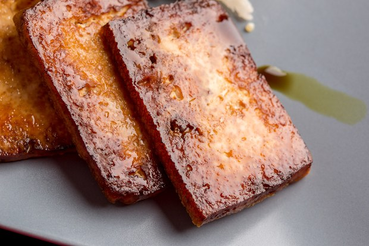

## Tofu Marinades

** Prep time: Traditional marinade: 24 hours or Fast marinade: 30 min || Cook time: 25 minutes **

## Ingredients: 

- 1 block extra-firm tofu, pressed
- Choose the marinade

## Marinades

### 1. Smoky Soy Marinade

- 1/4 cup of Tamari or soy sauce
- 1 tablespoon sesame oil
- 1 tablespoon  rice vinegar
- 1 teaspoon liquid smoke 
- 1/2 teaspoon onion powder
- splash Tabasco
- splash fish sauce (or vegan alternative) (optional) 

### 2. Ginger-Sesame Marinade

- 1/4 cup of Tamari or soy sauce
- 1/4 cup of rice vinegar
- 2 tablespoons lime juice
- 2 tablespoons brown sugar
- 1 tablespoon minced fresh ginger
- 2 teaspoons toasted sesame oil
- 2 teaspoons Sriracha or other hot sauce
- 2 cloves garlic, thickly slices

### 3. Smoky Maple Marinade

- 1/4 cup Tamari or soy sauce
- 1/4 cup of broth or water
- 2 tablespoons maple syrup
- 1 tablespoon liquid smoke
- 1 tablespoon lemon juice
- 1 tablespoon tomato paste
- 1 tablespoon olive oil
- 2 cloves garlic, thickly slices

### 4. Sweet Citrus Marinade

- 1/2 cup of orange juice
- 1/4 cup Tamari or soy sauce
- 1 tablespoon brown sugar
- 1 tablespoon minced fresh ginger
- 1 tablespoon olive oil
- 2 teaspoon Sriracha or other hot sauce
- 2 cloves garlic, thickly slices

### 5. Sweet White Wine Marinade

- 1/4 cup reduced-sodium natural soy sauce
- 1/4 cup white wine or broth
- 1 tablespoon dark sesame oil
- 1 tablespoon honey or maple syrup
- 2 tablespoons rice vinegar
- 2 cloves garlic, minced (optional)
- 1 teaspoon grated ginger, to taste
- Fresh or dried thyme leaves or oregano leaves, to taste (optional)

## Instructions

1. Press the tofu to removes all extra water. 
2. Slice the tofu about 1/4 inch thick width wise. 
3. Mix all the ingredients in a shallow dish/container that will hold the tofu in one layer. 
4. Add the tofu slices in the container, close the lid, shake so the tofu absorbed the sauce. Refrigerated overnight. 
	- For a fast marinade: leave it on the counter for about 30 minutes to an hour. 
5. Cook the Tofu: 
	1. Bake: 
		- Pre-heated the oven at 400F. 
		- Put the tofu in a single layer on a oiled baking rack over a baking sheet. 
		- Bake for about 15 minutes then flip the tofu over. Cook for about 15 minutes. 
		- Cook to your taste (slightly crispy to cripsy).
	2. Dried-fry: 
		- Preheat a large pan, over meadium heat. 
		- Once the pan is hot add the tofu in a single layer. You want it to sizzle once the tofu hits the pan. 
		- Sprinkle a pinch of salt over the tofu.
		- Start gently pressing down on the tofu with the spatula, until it toasted, for about 3-4 minutes until the bottom is golden brown. 
		- Flip them over and repeat.  
		- Fry the tofu both side until it is cook to your taste (slightly crispy to cripsy). 
6. When ready, cut the slices to your desired length and add to your dish.

