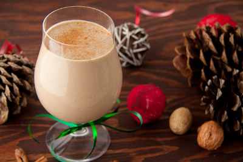

## Dairy-Free Eggnog

[Original Recipe by Leanne Voguel](https://www.healthfulpursuit.com/2011/12/dairy-free-eggnog/)

** Prep time: 10 minutes || Cook time: 15 minutes || Serving: 4 || Rating 9.5/10 **

### Ingredients

- 4 egg yolks
- 2.25 cups unsweetened vanilla almond milk
- 1 can (400mL) of full-fat coconut milk
- 1/4 cup coconut sugar
- 2 teaspoon pure vanilla extract
- 1 teaspoon ground nutmeg *see note
- 1 teaspoon ground cinnamon
- pinch allspice

### Instructions

1. Separate the whites from yolks. Place egg yolks in a small mixing bowl and set aside. 
2. Combine remaining ingredients in a medium sized saucepan and bring to a simmer on medium heat.
3. Reduce heat to low.
4. Slowly add approximately 1/4 cup of the hot liquids to the egg yolks while whisking continuously. Continue until you've added about 1 cup of the liquid mixture to the egg yolks before transferring the yolks to the pot.
5. Bring back up to medium heat and whisk while simmering for 4 minutes.
6. Remove from heat and serve immediately or refrigerate.

Best sprinkled with a touch of ground cinnamon and nutmeg!

### Notes

If you plan on drinking the eggnog right away, opt for less nutmeg (1/2 teaspoon is best). If you're planning on letting it sit for 1-2 days before enjoying, go with 1 teaspoon. Longer it sit, the more the flavor developed.
