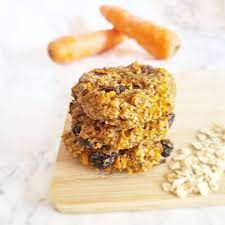

## Carrot Banana Cookies

** Prep time: XX minutes || Cook time: XX minutes || Serving: X || Rating X/10 **

### Ingredients

- 1 carrot,  grate
- 175g oats 
- 60g raisins 
- 2 ripe bananas, mash
- 1 1/2 teaspoon cinnamon 
- 1/2 teaspoon nutmeg 
- 4 tablespoons water 
- 30g coconut oil 
- Orange zest

### Instructions

1. Mix all the ingredients together. 
2. Leave to sit for 10 mins. Preheat the oven at 400F.
3. roll into balls and flatten on a baking sheet. 
4. Bake for 15 minutes.
