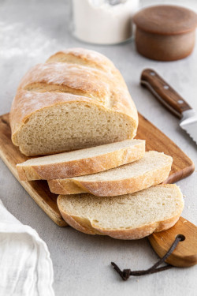

## Italian Loaf - Bread Machine

** Prep time: 5 minutes || Dough time: 1h 40 minutes || Rest time: 40 minutes || Bake time: 35 minutes || Serving: 1.5 lbs loaf || Rating 10/10 **

### Ingredients

- 236g water 
- 1/2 tablespoon olive oil
- 408g all purpose flour
- 1 tablespoon brown sugar (optional)
- 1/2 tablespoon salt  (add in corners of the bread machine pot)
- 1/2 tablespoon yeast (add it in flour well in the center)

### Instructions

1. Add all the ingredients in the following order: water, olive oil, flour, sugar (optional), salt and then yeast.
2. Set the bread machine setting on dough.
3. After the dough is complete, deflate and shape into a loaf.
4. Place the dough in a dutch oven with cornmeal on the bottom. Cover the dutch oven with a lid and let the dough rise for 40 minutes. 
5. Pre-heat the oven to 450F. 
6. Score the loaf (for example, one line in the middle of your loaf) about an inch deep. Put the lid on the dutch oven. 
7. Bake for 20 minutes (with the lid on)
8. Reduce the heat to 400F, uncover, and bake the bread for an additional 15 minutes, until crust is a deep golden brown. 
9. Completely cool on a baking rack before slicing. 
