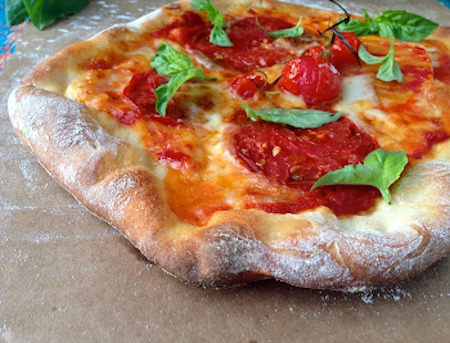

## Authentic Italian Pizza Dough

### 1. Franco Pepe Pizza Dough 
[Original Recipe by Franco Pepe](https://www.greatitalianchefs.com/recipes/pizza-dough-recipe)

** Prep time: 60 minutes, plus 6 hours first proof and 3 hours second proof || Serving: 10 || Rating X/10 **

#### Ingredients

- 1900 grams of OO or all-purpose flour
- 1L water
- 150 grams of leftover pizza dough (or sourdough discard)
- 50 grams of salt
- 5 grams of fresh yeast 

#### Instructions

1. Place 760 grams of the OO flour in the corner of a wooden kneading trough (or wooden box or a bowl. In the opposite corner, slowly pour in the water.
2. Add the old dough and mix thoroughly until dissolved. Add the salt and again mix until dissolved. Constantly add the remaining flour until the mixture has a batter-like consistency. At this stage, crumble in the fresh yeast.
	- If you are making this recipe for the first time, you can replace the leftover dough with some ready-made pizza dough (defrosted if bought frozen) from the shop, but be sure to reserve some of this new batch of dough to improve the flavour next time you make it.
3. Keep mixing and adding 1140g of 00 flour until it is all used up, then knead for another 15 minutes until the dough is smooth and consistent. 
4. Cover and leave to prove for 6 hours at room temperature.
5. After this time, divide the dough into 250g portions. Fold and shape into balls, pulling into the centre like a mozzarella ball. Leave to rise for another 3 hours at room temperature.
6. Place some of the dough in a jar and keep for next time you make pizza – you'll need 150g for every 2kg flour.

### 2. Rustic Italian Pizza Dough  

[Original Recipe by Florentina](https://ciaoflorentina.com/rustic-pizza-dough-recipe/)

** Prep time: 10 minutes || Cook time: 7 minutes || Total time: 17 minutes  || Serving: 6 || Rating X/10 **

#### Ingredients

- 5 cups all purpose or 00 flour + some for dusting
- 1 1/2 teaspoons active dry yeast
- 1 1/2 teaspoons sea salt
- 2 1/4 cups COLD water
- 1 tablespoon extra virgin olive oil

#### Instructions on Preparing the Dough

** Stand Mixer Method ** 

1. In the bowl of your stand mixer and using the paddle attachment: mix in the flour, sea salt and active dry yeast on low speed until all is incorporated. Then add the COLD water.
2. Switch to the dough hook and mix together on low speed for 8 to 10 minutes. The dough should be smooth and sticky but should not stick to the sides of the bowl, only a little to the bottom.
	- If the dough sticks to the sides sprinkle in a little more flour, if it is too dry then add a bit more water.
3. After the 8 minutes have passed remove the dough from the stand mixer and cut it into 6 pieces and form them into rounds ball. Place them on a lightly oiled cookie sheet and drizzle with 1 tbs of extra virgin olive oil. Cover with plastic wrap and allow to sit at room temperature and rise for 2 hours in a draft free area. 
4. Place a pizza stone in the oven (place the rack near the top of the oven, as the broiler will be used to finish the pizza), and preheat as high as it will go for at least 45 minutes to one hour.
5. Sprinkle the counter with a little bit of flour, take one piece of dough and press down on it with your fingers until you have 1/2" thick circle or oval. Using your fists and knuckles start stretching the dough until 10" in diameter making sure not to tear it ( this should be easy since it is a small pie).
6. Add your topping and bake in the oven at 400F.

** Hand Kneading Method **

1. Pour the flour into a large bowl. Add the yeast, salt and cold water and using a wooden spoon mix to combine well.
2. Sprinkle some flour on a work surface, after placing the pizza dough, sprinkle some more flour on top. 
3. By using your hand, knead the dough for about 10 to 15 minutes until a smooth ball forms but still a little bit sticky on the bottom. Follow the steps above afterwards.
4. Cut it into 6 pieces and form them into rounds ball. Place them on a lightly oiled cookie sheet and drizzle with 1 tbs of extra virgin olive oil. Cover with plastic wrap and allow to sit at room temperature and rise for 2 hours in a draft free area. 
5. Place a pizza stone in the oven (place the rack near the top of the oven, as the broiler will be used to finish the pizza), and preheat as high as it will go for at least 45 minutes to one hour.
6. Sprinkle the counter with a little bit of flour, take one piece of dough and press down on it with your fingers until you have 1/2" thick circle or oval. Using your fists and knuckles start stretching the dough until 10" in diameter making sure not to tear it.
7. Add your toppings and bake in the oven at 400F.
