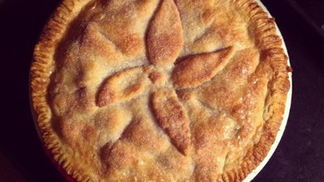

## Lard Pie Crust

[Original Recipe from Allrecipe](https://www.allrecipes.com/recipe/234976/classic-lard-two-crust-pie-pastry/) and
[Original Recipe from Taste Of Home](https://www.tasteofhome.com/recipes/mom-s-lard-pie-crust/)

** Prep time: 15 minutes + chilling || Makes: two-10inch crust pie pastry

### Ingredients

- 3.5 cups all-purpose flour
- 1 cup lard (keep the lard in the fridge for coldness)
- 1/4 teaspoon salt
- 3 to 4 tablespoons ice water (place a glass of cold water in the freezer)

### Instructions

1. In a bowl, combine flour and salt.
	- Before you begin, place a glass of water in the freezer (Cold ingredients ensure a more workable dough.).
2. Cut in lard with a pastry cutter until mixture resembles coarse crumbs. 
3. Sprinkle in water, 1 tablespoon at a time, until pastry holds together. 
	- A slightly sticky dough is easier to work with than one that's too dry.
	- Do not overwork the dough or allow the ingredients to warm to room temp! 
4. Divide the dough in half and shape flattened rounds. Wrap in plastic and refrigerate for at least 1 hour.
5. On a lightly floured surface, roll the dough to 1/8-inch. thickness. Transfer to a 10-inch pie plate. Fill the pie and bake as pie recipe directs. 

Note: 

If making multiples pie crusts, use the food processor. Briefly pulse the flour, lard, and salt to form pea-sized balls. Add between 4 and 6 tablespoons of ice water until a ball forms. Work quickly! Do not overwork the dough or allow the ingredients to warm to room temp! You can bake the bottom crust for a few minutes before adding the filling.
