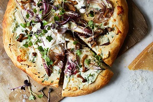
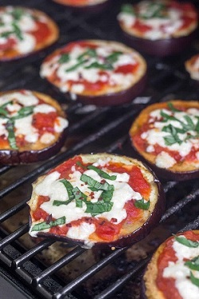

## Type of Pizza Crusts

### 1. Classic Pizza Crust

[Original Recipe from ]()

** Prep time: 15 minutes || Cook time: 10 minutes || Serving: two 12" rounds baking sheets **

#### Ingredients

#### Instructions

### 2. Sourdough Pizza Crust 

[Original Recipe from King Arthur Flour](https://www.kingarthurflour.com/recipes/sourdough-pizza-crust-recipe)

** Prep time: 2-4 hours || Cook time: 20 minutes || Serving: two 12" rounds baking sheets || Rating: 10/10 **

#### Ingredients

Note: This list is for regular-crust thickness. For thin-crusts divide the recipe in half and at step 8, bake it for 5 min.

- 2 cup sourdough discard 
- 1 cup warm water
- 5 cups All-Purpose Flour
- 2 teaspoon salt
- 1 teaspoon instant or active dry yeast

#### Instructions

1. Stir any liquid on top of your refrigerated starter back into it before measuring 1 cup into a large mixing bowl. Note: This is a good opportunity to feed the remainder of your starter, if necessary.

2. Add the warm water, flour, salt, yeast. Mix to combine, then knead for about 7 minutes in a mixer with the dough hook, until the dough wraps itself around the hook and cleans the side of the bowl.

3. Place the dough in a greased container, cover and let rise until almost doubled in bulk. Depending on the vitality of your starter, this will take between 2 and 4 hours. For a faster rise, place the dough in a warm spot, or double the yeast.

4. Divide the dough in half, and shape each into a flattened disk. Drizzle two 12" round pizza pans with olive oil, and brush to coat the bottom. Place the dough in the pans, cover, and let rest for 15 minutes. After this rest, gently press the dough toward the edges of the pans. If it starts to shrink back, cover and let rest for 15 minutes before continuing.

6. Cover the pan(s) and let the dough rise until it's as thick as you like.

7. Towards the end of the rise time, preheat your oven to 450°F.

8. Bake the crust until it become partially cook (about 10 minutes). Then add the sauce and choice of toppings. Return to the oven and bake until the cheese is melt (about 5 to 7 min.).

### 3. Authentic Paleo Pizza Crust

[Original Recipe by Nicole Hunn](https://glutenfreeonashoestring.com/paleo-pizza/)

** Prep time: 15 minutes || Cook time: 10 minutes || Serving: 1 10" to 12" baking sheets || Rating: X/10 **

#### Ingredients

- 1/3 cup (2 2/3 fluid ounces) warm water
- 3 tablespoons (42 g) extra virgin olive oil, plus more for brushing
- 1 tablespoon (21 g) honey
- 2 1/4 teaspoons active dry yeast (or 1 3/4 teaspoons instant yeast)
- 1 egg at room temperature, beaten
- 1/2 teaspoon kosher salt, plus a pinch for sprinkling
- 1 1/2 cups (180 g) tapioca flour, and XX cups, plus more for dusting
- 1 cup (120 g) almond flour, plus more as needed

#### Instructions

1. In a large bowl, combine the water, olive oil, and honey and whisk to combine well. Sprinkle the yeast on top and let it sit for about 5 minutes, until foamy. 
2. Whisk in the egg. Add the salt and tapioca flour and whisk until a smooth, sticky batter forms. Switch to a spatula or wooden spoon and stir in the almond flour, and then stir in the remaining tapioca flour. The dough should appear shaggy.

    Dust your hands with a little tapioca flour and press the dough into a ball, kneading it a bit to get any floury bits mixed in. If it’s too sticky to come together, add additional almond flour a tablespoons at a time. Return the ball of dough to the bowl, cover it with plastic wrap, and set it in a warm place for 45 minutes (I usually set my oven to 200°F just for a couple minutes, then turn it off. I then place the bowl of dough in the oven, which is just a little above room temperature). The dough won’t double in size, but will get noticeably bigger. Place a pizza stone or large, overturned rimmed baking sheet in the oven and preheat to 375°F.

    Place a large sheet of parchment paper on a flat surface, and, with lightly tapioca floured hands, transfer the ball of dough to the parchment. Pat the dough out into a circle about 12 inches in diameter, pushing out toward the edges to form a puffy rim of crust. Brush the top of the dough with a little bit of olive oil and sprinkle with a pinch of sea salt.

    Carefully transfer the parchment with the dough onto the pizza stone or sheet pan and bake for 8 minutes. Remove the dough from the oven, prick the middle of the dough in several places with a fork, and add your desired toppings. Return to the oven and for about 5 minutes more. If desired, set the oven to broil and broil the pizza for up to two minutes until browned to your liking. Remove from the oven, slice, and serve hot. Any leftovers will reheat beautifully in just a few minutes in a 400°F oven.

### 4. Bell Pepper Pizza Crust

[Original Recipe from Paleo Leap](https://paleoleap.com/bell-pepper-pizza-bites/)

** Prep time: 20 minutes || Cook time: 15 minutes || Serving: 2 || Rating: 10/10**

#### Ingredients

- 2 green bell peppers
- 1/2 cup homemade pizza sauce
- toppings, uncooked (meat toppings have to be already cook) 

#### Instructions

1. Preheat your oven to 400 F.

2. Slice each bell pepper into 4 equal slices, carefully removing the seeds.

3. Top each pepper quarter with pizza sauce and your choice of toppings.

4. Place the pizza on a baking sheet, and place in the oven.

5. Bake for 12 to 15 minutes. Stick them under the broiler and broil on high for 3 to 4 more minutes.

### 5. Eggplant Pizza Crust

[Original Recipe by Kelly|Eat the gains](https://eatthegains.com/grilled-eggplant-pizza/)

[Original Recipe by Vered DeLeeuw](https://healthyrecipesblogs.com/eggplant-pizza-recipe/)

[Original Recipe by Brittany Mullins ](https://www.eatingbirdfood.com/low-carb-eggplant-pizza/)

** Prep time: 15 minutes || Cook time: 10 minutes || Serving: 2-4 **

#### Ingredients

- 1 eggplants, unpeeled, slice crosswise or lenghtwise into 1/4-inch-thick
- 1/2 cup homemade pizza sauce
- toppings, uncooked (meat toppings have to be already cook) 

#### Instructions

1. Three ways to prepared the eggplant crust
	- grilled: 
		1. grill the eggplant until it softens, but still has some firmness to it (about 10-15 minutes). 
		2. Add the pizza sauce and the toppings. 
		3. grilled the eggplant pizzas until ready. 
	- Roasted: 
		1. Preheat the oven to 450F. 
		2. Line a large baking sheet with foil and spray it with olive oil cooking spray.
		3. Place the eggplant rounds on the prepared baking sheet. Spray them with olive oil spray. Sprinkle with kosher salt, black pepper and garlic powder. 
		4. Bake the eggplant rounds for 10 minutes. Remove from the oven, turn them over, spray with more olive oil and bake 10 more minutes.
		5. Remove the pan from the oven. Switch the oven to broil, setting it on high. With a spoon, spread marinara sauce on each eggplant round. Top with a basil leaf and sprinkle with cheese, dividing the sauce, basil and cheese evenly among the eggplant slices.
		6.Return the pan to the oven. Broil 2-3 minutes, keeping a close eye on them, just until cheese is melted and golden-brown. 
		7. Let rest 5 minutes before serving.
	- Baked: 
		1. Brine the round slice eggplants (it to draw out the bitterness and keep the shape of the eggplant) 
			- Fill a large bowl with 1 tablespoon salt and about 1/2 cup hot water. Stir until salt dissolves completely.
			- Fill the bowl with about 2 quarts cold water. The water should taste salty.
			- Completly submerge the eggplants pieces in the salted water for at least 30 minutes up to 1 hour.
			- Drain the eggplant and pat it dry.
		2. Preheat the oven to 400°F.
		3. Brush or rub a little olive oil on each side of the eggplant slices and place on a baking sheet lined with parchment paper or a baking stone. Sprinkle with salt and pepper. 
		4. Place in oven for 7-10 minutes.
		5. Remove the eggplant slices from the oven, add toppings on eggplant slices. 
		6. Place in the oven until the cheese has melted (for about 5 minutes). 

### 6. Cauliflower Pizza Crust

[Original Recipe from ]()

** Prep time: 15 minutes || Cook time: 10 minutes || Serving: two 12" rounds baking sheets **

#### Ingredients

#### Instructions

### 7. Cheese Pizza Crust

[Original Recipe from ]()

** Prep time: 15 minutes || Cook time: 10 minutes || Serving: two 12" rounds baking sheets **

#### Ingredients

#### Instructions

### 8. Buffalo Chicken Pizza Crust

[Original Recipe from Ruled me](https://www.ruled.me/buffalo-chicken-crust-pizza/)

** Prep time: 15 minutes || Cook time: 10 minutes || Serving: two 12" rounds baking sheets **

#### Ingredients

- 1 pound boneless and skinless chicken thighs
- 1 cup shredded whole milk mozzarella
- 1 large egg
- 1 teaspoon dried oregano
- ¼ teaspoon black pepper
- ¼ teaspoon salt

#### Instructions

1. Preheat oven to 400°F.
2. Grind up the chicken thighs a food processor. Transfer to a large mixing bowl.
3. Add shredded mozzarella, egg, oregano, pepper, and salt to the mixing bowl.
4. Mix the chicken crust together until all of the shredded cheese is tucked inside the "dough."
5. Spray oil on a lined baking sheet,  and spread the chicken out with the back of a spoon , until it's about ¼ of an inch thick. 
6. Bake for 25 minutes, or until the crust is cooked through and starting to brown on top.
7. Once the crust is baked, remove it from the oven. Add the pizza sauce and the choice of toppings.
8. Cook for another 10 minutes, until the cheese is melted and starts to brown.
