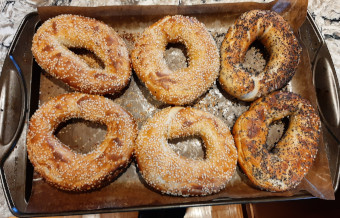

## Sourdough Bagels 

Combined from these original recipes:

[1](https://honestcooking.com/peter-reinharts-new-york-style-bagels-wild-sourdough/) 
[2](https://www.thespruceeats.com/montreal-style-bagels-recipe-2215510)

** Prep time: 2 hours + overnight || Cook time: 20 minutes || Serving: 16 || Rating 11/10 **

### Ingredients

#### Sponge

- 500g bread flour, or all-purpose flour
- 500g warm water
- 2 Tablespoons active sourdough starter

#### Dough

- sourdough sponge, prepared above
- 2 large eggs, beaten
- 1/4 cup neutral oil (light olive oil, avocado oil, etc.)
- 1/2 cup honey
- 1 teaspoon yeast
- 1 Tablespoon salt
- 500g bread flour, or all-purpose flour

- 2 Tablespoons baking soda

#### Toppings

- sesame seeds
- poppy seeds

### Instructions

#### Sponge

1. Combine water and starter, and mix well.
2. Add the flour. Mix thoroughly, and scrape down sides of bowl with a spatula
3. Cover lightly with plastic wrap.
4. Allow sponge to sit on the counter overnight

#### Dough

1. Combine the sponge with the eggs, oil, honey, and yeast.
2. Mix in the salt
3. Incorporate approximately 350g flour. If the dough does not yet have enough strength to be turned out onto the counter for kneading, add additional flour 1/4 cup at a time until it reaches the desired consistency.
4. Knead the dough for about 10 - 15 minutes, incorporating additional flour until the dough becomes 'tacky' rather than 'sticky'.
5. Immediately separate the dough into 125g pieces. Roll each piece into a ball, and then into a sausage shape (cylinder about 15 cm long)
6. Cover with a kitchen towel, and allow the dough cylinders to rest for 20 minutes.
7. Roll the cylinders until they are about 25 cm long.
8. Bring the two ends of a piece together and pinch and twist them, rolling that section of the circle between your hands to be sure it is fully sealed.
9. Place the dough ring on a parchment-lined baking sheet.
10. Repeat until all the cylinders are processed (I usually only put 5-6 bagels per sheet). 
11. Cover the sheets with a damp kitchen towel, and allow to rise for an hour
12. Over high heat, bring a large, full pot of water to a rolling boil
13. Preheat your oven to 475F if using convection, or 500F if not
13. Add baking soda to the water, and keep the heat on high.
14. Add two bagels to the boiling water.
15. Using a slotted spoon, gently dislodge them from the bottom of the pot if they stick.
16. Allow the bagels to boil for one minute.
17. Remove the bagels from the pot, and dry on a kitchen towel.
18. Once all the bagels on the sheet are boiled, add the topping of your choice to both sides of the bagel.
19. Place baking sheets into the oven, and bake for 10 minutes, or until golden brown.
20. Flip the bagels, and return to bake for an additional 5 minutes, or until a deep brown colour.
21. Remove from the oven, and allow the bagels to cool.
22. I like to immediately slice, and freeze any bagels that I don't eat right away, as I find that they keep very well this way.
