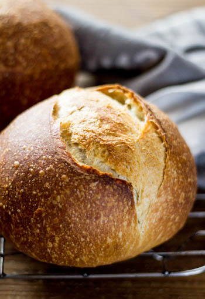

## Sourdough Loaves

[Original Recipe From Radical Health and King Arthur Flour]

** Serving: 2 loaves || Rating 10/10 **

### 1. Plain Sourdough Bread (for 2 loaves)

#### Ingredients

- 454g active sourdough starter (recently fed so it is bubbly)
- 602g All-Purpose Flour
- 85g Whole Wheat Flour
- 397g room-temperature water
- 2 1/2 teaspoons salt

#### Instructions

1. Mix all the ingredients and form soft dough. 
	- Leave it a little on the wet side, you can add more water, which makes bread with more holes. If dough is sticky keep your hands wet. 
2. First Rise:
	- Leave it in the bowl in a warmish room-temperature place to rise for 1 hour. 
3. Knead: 
	- After the first rise, gently knead dough (punch it down) for a couple of minutes, until it's smooth and supple, though still somewhat soft and tacky. When fully kneaded, place the dough back in the bowl, cover, and let it rise for 1 hour.
4. Fold: Give the dough a fold:
	-  Turn it out onto a floured surface and, using a bowl scraper or bench knife, fold it like a business letter. Turn the dough 90 degrees. Gently flatten it a bit, and repeat the letter fold. Return the dough to the bowl, cover, and let it rise for another hour.
5. Pre-Shape:
	- At the end of the rise, turn the dough out onto a lightly floured surface and divide it in half. Gently shape into two rounds, cover, and let rest for 20 minutes.
6. Shape: 
	- Form into a loaf shape of your choosing. Leave to rise in a dutch oven for 3 hours (or overnight) until risen (cover the second loaf with a towel, and leave on the counter).	
7. Preheat the oven to 400F. 
	- score the loaf (for example, one line in the middle of your loaf) about an inch deep. 
	- Put the lid of your dutch oven on (make sure it is put on correctly so the steam does its work).
	- Bake for 25 minutes, and remove the lid.
	- Bake for an additional 20-30 minutes, until crust is a deep golden brown. 
	- Leave to cool completely before slicing. 

### 2. Beer Sourdough Bread (for 2 small loaves)

#### Ingredients

- 12 oz. room temperature beer (The type of beer will affect the flavour of the bread.) 
- 1 cup active sourdough starter (recently fed so it is bubbly)
- 4 Tablespoon of sugar (honey, cane sugar, or etc.)
- 1 1/2 teaspoon salt
- 5 cups white bread flour or all- purpose flour

#### Instructions

1. Mix beer and sourdough starter in a large bowl. 
2. Add remaining ingredients and mix to form soft dough. 
	- Leave it a little on the wet side, you can add more water, which makes bread with more holes. If dough is sticky keep your hands wet. 
3. First Rise:
	- Leave it in the bowl in a warmish room-temperature place to rise for 1 hour. 
4. Knead: 
	- After the first rise, gently knead dough (punch it down) for a couple of minutes, until it's smooth and supple, though still somewhat soft and tacky. When fully kneaded, place the dough back in the bowl, cover, and let it rise for 1 hour.
5. Fold: Give the dough a fold:
	-  Turn it out onto a floured surface and, using a bowl scraper or bench knife, fold it like a business letter. Turn the dough 90 degrees. Gently flatten it a bit, and repeat the letter fold. Return the dough to the bowl, cover, and let it rise for another hour.
6. Pre-Shape:
	- At the end of the rise, turn the dough out onto a lightly floured surface and divide it in half. Gently shape into two rounds, cover, and let rest for 20 minutes.
7. Shape: 
	- Form into a loaf shape of your choosing. Leave to rise in a dutch oven for 3 hours (or overnight) until risen (cover the second loaf with a towel, and leave on the counter).	
8. Preheat the oven to 400F. 
	- score the loaf (for example, one line in the middle of your loaf) about an inch deep. 
	- Put the lid of your dutch oven on (make sure it is put on correctly so the steam does its work).
	- Bake for 25 minutes, and remove the lid.
	- Bake for an additional 20-30 minutes, until crust is a deep golden brown. 
	- Leave to cool completely before slicing. 

### 3. Honey Oatmeal Sourdough Bread (for 2 loaves)

#### Ingredients

- 2 cups active sourdough starter (recently fed so it is bubbly)
- 1 cup of milk or milk alternative
- 2/3 cup water
- 1/4 cup oil or melted butter
- 1/4 cup honey
- 1 cup of quick oats
- 2 1/2 cup whole wheat flour 
- 3 cups white flour 
- 3 teaspoon salt

#### Instructions

1. Mix all the ingredients EXCEPT SALT for 2-3 minutes. Allow the dough to rest for about 20 minutes. 
2. Add salt and knead dough for about 5 minutes. 
	- If dough is too sticky, add more flour but dough should be soft and not dry and stiff.
2. First Rise:
	- Leave it in the oiled bowl in a warmish room-temperature place to rise for 1 hour. 
3. Knead: 
	- After the first rise, gently knead dough (punch it down) for a couple of minutes, until it's smooth and supple, though still somewhat soft and tacky. When fully kneaded, place the dough back in the bowl, cover, and let it rise for 1 hour.
4. Fold: Give the dough a fold:
	-  Turn it out onto a floured surface and, using a bowl scraper or bench knife, fold it like a business letter. Turn the dough 90 degrees. Gently flatten it a bit, and repeat the letter fold. Return the dough to the bowl, cover, and let it rise for another hour.
5. Pre-Shape:
	- At the end of the rise, turn the dough out onto a lightly floured surface and divide it in half. Gently shape into two rounds, cover, and let rest for 20 minutes.
6. Shape: 
	- Form into a loaf shape of your choosing. Leave to rise in a dutch oven for 3 hours (or overnight) until risen (cover the second loaf with a towel, and leave on the counter).	
7. Preheat the oven to 400F. 
	- score the loaf (for example, one line in the middle of your loaf) about an inch deep. 
	- Put the lid of your dutch oven on (make sure it is put on correctly so the steam does its work).
	- Bake for 25 minutes, and remove the lid.
	- Bake for an additional 20-30 minutes, until crust is a deep golden brown. 
	- Leave to cool completely before slicing. 

### 4. Whole-wheat Sourdough Bread (for 2 loaves)

#### Ingredients

- 2 cups active sourdough starter (recently fed so it is bubbly)
- 1 cup of milk or milk alternative
- 1/2 cup water
- 1/4 cup oil or melted butter
- 1/4 cup honey
- 5 cup whole wheat flour 
- 3 teaspoon salt

#### Instructions

1. Mix all the ingredients EXCEPT SALT for 2-3 minutes. Allow the dough to rest for about 20 minutes. 
2. Add salt and knead dough for about 5 minutes. 
	- If dough is too sticky, add more flour but dough should be soft and not dry and stiff.
2. First Rise:
	- Leave it in the oiled bowl in a warmish room-temperature place to rise for 1 hour. 
3. Knead: 
	- After the first rise, gently knead dough (punch it down) for a couple of minutes, until it's smooth and supple, though still somewhat soft and tacky. When fully kneaded, place the dough back in the bowl, cover, and let it rise for 1 hour.
4. Fold: Give the dough a fold:
	-  Turn it out onto a floured surface and, using a bowl scraper or bench knife, fold it like a business letter. Turn the dough 90 degrees. Gently flatten it a bit, and repeat the letter fold. Return the dough to the bowl, cover, and let it rise for another hour.
5. Pre-Shape:
	- At the end of the rise, turn the dough out onto a lightly floured surface and divide it in half. Gently shape into two rounds, cover, and let rest for 20 minutes.
6. Shape: 
	- Form into a loaf shape of your choosing. Leave to rise in a dutch oven for 3 hours (or overnight) until risen (cover the second loaf with a towel, and leave on the counter).	
7. Preheat the oven to 400F. 
	- score the loaf (for example, one line in the middle of your loaf) about an inch deep. 
	- Put the lid of your dutch oven on (make sure it is put on correctly so the steam does its work).
	- Bake for 25 minutes, and remove the lid.
	- Bake for an additional 20-30 minutes, until crust is a deep golden brown. 
	- Leave to cool completely before slicing. 

### Notes 

- Pre-shaping dough creates the basic shape the loaf will eventually be, without refining that shape. Why pre-shape? Any time you handle dough its gluten tightens up, making it more resistant to further shaping. Pre-shaping dough then letting it rest before its final shaping relaxes its gluten, making it much easier to shape into its final form.
- Loaf should feel light for its size, and sound hollow when tapped on the bottom.
- To freeze: Slice your loaf and put it in a brown bag and put the brown bag in a plastic freezer Ziploc bag. 
