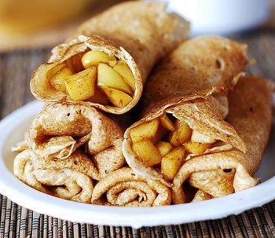

## Crêpe Francçaise avec garnitures (French Crepe with filling)

[Original Recipe by Rachael](https://www.eazypeazymealz.com/dairy-free-crepes/) & [Original Recipe by Rowena Dumlao-Giardina](https://skinnyms.com/dairy-free-crepes/) 

** Prep time: 15 minutes || Cook time: 2 minutes || Serving: 4 || Rating 10/10 **

### Ingredients

- 1 cup flour
- 1-1/4 cup water
- 2 eggs
- 1 teaspoon honey
- pinch of salt
- 1-1/4 tablespoons olive oil, divided

- Filling of your choice (optional)
- whip creame (optional)
- Maple Syrup

Note: This batter can be prepare the day before and let it rest in the fridge overnight.

### Crepe Instructions

1. In a blender combine all ingredients.
2. Mix well, then let whip for an extra 30-45 seconds.
3. Add some butter/oil in a pan heated over medium heat.
4. Pour about 1/4 cup of batter, and quickly tilt pan from side to side in all directions to spread and cover the pan bottom with the batter.
5. Cook for approximately 45 seconds, then flip and cook for another 30 seconds.
6. Transfer the crepe aside and cook the rest of the batter. 

To serve, add some filling in a aline across the crepe along with whip creme and roll up. Drizzle maple syrup on top. 

### Filling Instructions

#### Berry Filling

- 2 cups blueberries (can substitute with: any or all berries: blueberry, strawberry, raspberry, cherry)
- sugar (honey or maples), to taste
- 2 tablespoons cornstarch
- lemon juice, to taste
	
1. In a small pot, combine the sugar, cornstarch and berries of choice.
2. Cook and stir until mixture comes to a boil. Simmer 1 minute. 
3. Stir in the lemon juice.
	
#### Apple and Cinnamon Pie Filling

- 3 apples, cored and peeled, chopped
- sugar (honey/maple), to taste
- cinnamon, to taste
- lemon juice, to taste

1. In a small bowl, combine sugar and cinnamon. 
2. Add in the apples to coat them. Let it rest while cooking crepe (about 10-20 minutes).
3. Heat apples on medium heat in a skillet. 

#### Apple Cinnamon Cream Filling
- 3 apples, cored and peeled, chopped
- sugar (honey/maple), to taste
- cinnamon, to taste
- lemon juice, to taste
- Dash salt 
- 2 tablespoons cornstarch
- 2 tablespoon of cold water

1. In a small pot over medium heat, combine and stir to dissolve: sugar, cornstarch, cinnamon, salt and cold water. 
3. Stir-in the apples and lemon juice. Cook and stir often until the apples have softened and liquid has thickened (about 5 minutes).

#### Orange suzette filling
- 
