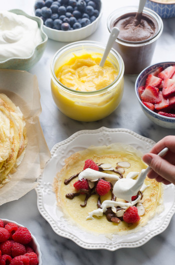
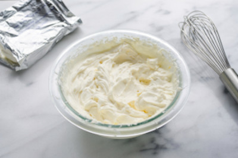

## Crêpes Françaises avec Garnitures (Sweet Crepe Buffet)

[Original Recipe by Rachael](https://www.eazypeazymealz.com/dairy-free-crepes/) & [Original Recipe by Rowena Dumlao-Giardina](https://skinnyms.com/dairy-free-crepes/) 

## Ingredients needed for a Buffet

- Crepes
- Fresh fruits: 
	- berries (strawberry, raspberry, blueberry, blackberries) 
	- cherry, banana, kiwi, thin slices of peaches and pineapple 
	- stew thin slices of apples and pears
- Fruit Fillings:
	- e.g. berry filling, apple cinnamon cream filling
- Cream Fillings:
	- Whipped cream cheese or Coconut Whipped Cream (dairy-free)
	- Chocolate hazelnut spread
	- Lemon curd
	- Nut Butter cream (almond butter, peanut butter etc.)
- Toppings:
	- toasted coconut
	- toasted sliced almonds, granola etc.
- Pure Maple Syrup

## Crepe Recipe 
** Dairy-free and Gluten-free **

** Prep time: 15 minutes || Cook time: 2 minutes || Serving: 4 || Rating 10/10 **

- 1 cup flour (if gluten-free, add Bob's mill gluten free pancake mix)
- 1-1/4 cup water
- 2 eggs
- 1 teaspoon honey
- pinch of salt
- 1-1/4 tablespoons olive oil, divided

- Filling of your choice (optional)
- whipped cream (optional)
- Maple Syrup

Note: This batter can be prepared the day before and allowed to rest in the fridge overnight.

** Instructions **

1. In a blender combine all ingredients.
2. Mix well, then let whip for an extra 30-45 seconds.
3. Add some butter/oil in a pan heated over medium heat.
4. Pour about 1/4 cup of batter, and quickly tilt pan from side to side in all directions to spread and cover the pan bottom with the batter.
5. Cook for approximately 45 seconds, then flip and cook for another 30 seconds.
6. Transfer the crepe aside and cook the rest of the batter. 

To serve, add some filling in a a line across the crepe along with whipped cream and roll up. Drizzle maple syrup on top. 

## Fruit Filling Recipes

### 1. Fruit Filling

** Ingredients **

- 2 cups fruits of your choice (e.g. wild berries, strawberry, raspberry, blueberry, blackberry, peach, mango)
- sugar (honey or maples), to taste
- 2 tablespoons cornstarch
- lemon juice, to taste

** Instructions **

1. In a small pot, combine the sugar, cornstarch and fruits of choice.
2. Cook and stir until mixture comes to a boil. Simmer 1 minute. 
3. Stir in the lemon juice.
	
### 2. Apple and Cinnamon Pie Filling

** Ingredients **

- 3 apples, cored and peeled, chopped
- sugar (honey/maple), to taste
- cinnamon, to taste
- lemon juice, to taste

** Instructions **

1. In a small bowl, combine sugar and cinnamon. 
2. Add in the apples to coat them. Let it rest while cooking crepe (about 10-20 minutes).
3. Heat apples on medium heat in a skillet. 

### 3. Apple Cinnamon Cream Filling

** Ingredients **

- 3 apples, cored and peeled, chopped
- sugar (honey/maple), to taste
- cinnamon, to taste
- lemon juice, to taste
- Dash salt 
- 2 tablespoons cornstarch
- 2 tablespoon of cold water

** Instructions **

1. In a small pot over medium heat, combine and stir to dissolve the sugar, cornstarch, cinnamon, salt and cold water. 
3. Stir in the apples and lemon juice. Cook and stir often until the apples have softened and liquid has thickened (about 5 minutes).

## Cream Filling Recipes

### 1. Whipped Cream Cheese Recipe

[Original Recipe by Erica from The Pioneer Woman](https://thepioneerwoman.com/food-and-friends/how-to-make-cream-cheese-whipped-cream/) 

** Prep time: 5 minutes || Chill time: 15 minutes || Serving: 8 || Rating 9.5/10 **

** Ingredients **

- 8 ounces, weight Cream Cheese, Softened
- 2 Tablespoons Maple Syrup, icing or cane sugar, adjust to taste
- 2 cups Whipping Cream
- 1/4 teaspoon Vanilla Extract

** Instructions **

1. Place the cream cheese and sugar in a large bowl. Beat until completely smooth. Scrape down the sides of the bowl.
1. Pour the heavy cream into the cheese mixture. Beat until completely smooth. Scrape down the sides of the bowl.
1. Add vanilla and beat until smooth. Store in the refrigerator until ready to use. 
	- Note: If you want the cream cheese whipped cream to be soft, take out of the refrigerator for about 15 minutes and give it a good whisk before serving.

Notes:
- Makes enough to frost a layer cake made with two 6-inch layers. 

### 2. Dairy-free Whipped Cream Recipes

#### 1) Coconut Whipped Cream 

 [From the Fuss-Free Vegan Cookbook](https://www.amazon.ca/s?k=fuss+free+vegan&crid=2QXY700P3THUW&sprefix=fuss+fr%2Caps%2C-1&ref=nb_sb_ss_i_1_6)

** Prep time: 5 minutes + overnight pre-chill of coconut milk || Serving: 1 1/4 cups || Rating X/10 **

** Ingredients **

- 1 can coconut cream (or premium coconut milk)
- 2 tablespoons icing sugar
- 1 teaspoon vanilla
- 1-4 tablespoons non-dairy milk (as required to achieve desired consistency)

** Instructions **

1. Chill coconut milk overnight in fridge.
1. Scoop coconut cream, as well as icing sugar, and vanilla into bowl of mixer.
1. Beat until light and fluffy, adding milk as required.
1. Store in an air-tight container in the fridge for up to one week.

#### 2) Cashew-based Vegan Heavy Cream

[From the Fuss-Free Vegan Cookbook](https://www.amazon.ca/s?k=fuss+free+vegan&crid=2QXY700P3THUW&sprefix=fuss+fr%2Caps%2C-1&ref=nb_sb_ss_i_1_6)

** Prep time: 5 minutes || Serving: 2 cups || Rating 9/10 **

** Ingredients **

- 1 cup soaked, raw cashews
- 1 cup water
- 2 tsp maple syrup
- 1 tsp vanilla extract

** Instructions **

1. Place all ingredients in a food processor and blend (for about 5-7 minutes) until it reaches the desired consistency. Add additional water as needed.
1. Store in an air-tight container in the fridge for 1 week, or freeze.

### 3. Chocolate Hazelnut Spread

** Ingredients **

- Chocolate Hazelnut spread (e.g. Nutella)
- milk (e.g. almond milk)

** Instructions **

1. Put the desired amount of chocolate hazelnut spread in a bowl. 
2. microwave it to soften it. 
3. Add some milk and mix it well. 
4. Adjust the consistency of the cream with additional milk if needed. 

### 4. Lemon Curd 

** Ingredients **

** Instructions **

### 5. Nut Butter Cream

** Ingredients **

** Instructions **

