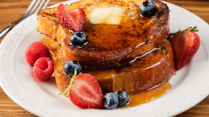

## Classic or Cinnamon French Toast

** Prep time: 5 minutes || Cook time: 4 minutes || Serving: 4 **

### Ingredients

- 8 1 inch thick bread (stale bread will work well)
- 2 large eggs
- 1/4 cup of milk (alternative plant-based)
- 1/2 teaspoon vanilla extract

** For Cinnamon French Toast **

- 1/2 teaspoon ground cinnamon
- 1/8 teaspoon of nutmeg

** For serving **

- maple syrup
- wild berries (blueberry, raspberry, strawberry etc.)

### Instructions

1. In a shallow dish, beat the eggs. 
2. Add the remaining ingredients. Mix well. 
	- For cinnamon french toast, add the cinnamon and nutmeg as well. 
3. Dip the bread slices both sides in the egg mixture. 
4. In a frying pan over medium heat, heat the oil/butter. Then cook the bread until golden brown, turning once, about 1-2 minutes per side. 

Enjoy your cheerful breakfast!
