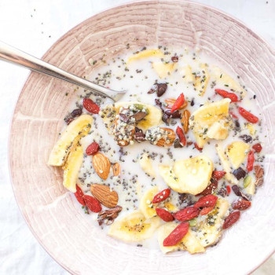

## Grain-Free Fruit Cereal

** Prep time: 5 minutes ||Rating 10/10 **

### Ingredients

Gather all your desired ingredients: 

- Milk: Almond, Soy, Cashew, Coconut, Cow, Goat, Hemp
- Fresh Fruits: Banana, Berries, apples, mango, pineapple
- Dried Fruits: Apricots, Apples, Banana, Cranberries, Grates Coconuts, Dates, Goji berries, Mango
- Nuts: Almonds, Pecan, Walnuts, Macadamia Nuts
- Seeds: Chia, Hemp, Flax, Sunflowers, Pumpkin Seeds
- Other toppings: 
	- Nut Butter
	- Cinnamon or Nutmeg 
	- Pumpkin spice mix
	- Drizzle of honey or maple syrup

### Instructions

1. Mix together your chosen ingredients with the desired amount. Enjoy your fast meal!

** Note: You can prepared the no grain cereal in advance (without fresh fruits) and keep it in an airtight lid container for a few weeks. If you add hemp or flax seeds, keep it in the refrigerator for freshness. **

** Suggestion quantities **

 - 3 Cups Nuts
 - 3/4 cup Dried banana chips
 - 1/4 cup Sunflower seeds
 - 1/4 Cup chia seeds
 - 1/4 Cup Hemp seeds
 - 1/4 Cup Goji berries
 - 1/4 cup Cacao nibs
