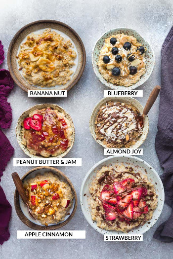
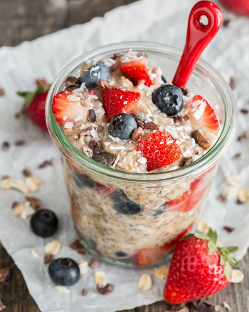

## Breakfast Oatmeal 

### 1. Stove-top Oatmeal

Picture from Life Made Sweeter

** Prep time: 10 minutes || Cook time: 10 minutes || Serving: 2 || Rating 10/10 **

** Ingredients **

- 1 cup rolled oats (steel cut oats will need to be cooked longer)
- 2 cups milk (nut, soy, oat, etc.) or water
- dash salt
- optional additions of your choice:
	- dried fruits (apricots, raisins, cranberries, etc.)
	- fruits (apples, pears, berries, bananas, kiwi, oranges etc.)
	- nuts (almond slices, walnuts, shredded coconut, peanuts etc.)
	- sweeteners (honey or maple syrup) 
	- dash cinnamon 
	
** Instructions **

1. In a large saucepan, bring the milk (and any dry fruit, if using) to a gentle simmer over medium heat.
1. Add the oats, mix, and allow the mixture to come to a boil (be careful, as this will boil over very easily).
1. Reduce heat to low, and allow to simmer, with frequent mixing, for about 5 minutes, or until the oatmeal reaches the desired consistency.
1. Serve with chopped fresh fruit.

### 2. Overnight Oatmeal

[Original Recipe from Oh She Glows](https://ohsheglows.com/2015/07/22/vegan-overnight-oats/)

** Prep time: 5 minutes + overnight || Cook time: 0 minutes || Servings: 2 || Rating 9.5/10 **

** Ingredients **

- 1 cup (250 mL) rolled oats
- 1 1/2 (375 mL) almond milk, or dairy-free milk of your choice
- 1/4 cup (60 mL) chia seeds
- 1 ripe banana
- 1 tsp cinnamon
- 1 tsp vanilla
- 1/2 tsp salt
- optional: 
	- dried fruits (apricots, raisins, cranberries, etc.)
	- chopped fresh fruit (apples, pears, pineapples, oranges, bananas, mangoes, kiwis, berries, etc.)

** Instructions **

1. Mash the banana in a large bowl.
1. Add the other ingredients, and mix well (add any dry fruit, if using, at this point).
1. Cover, and refrigerate overnight.
1. Serve the oatmeal with chopped fresh fruit. 
