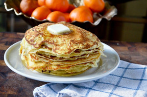

## Classic Pancakes

** Prep time: 5 minutes || Cook time: 10 minutes || Serving: 6 **

### Ingredients

** In a large bowl **

- 1 cup (for thin pancakes) all purpose flour or 1 1/3 cup (for fluffy pancake) 
	- If gluten-free use bob mills pancake mixture
- 2 tablespoons sugar (honey, maple, cane sugar, etc.)
	- If using honey or maple syrup, add it in small bowl
- 1 tablespoon baking powder
- 1/2 teaspoon of salt

** In a small bowl **

- 1 egg beaten
- 1 1/2 cup milk
- 2 tablespoons melted butter/olive oil
- 1/4 teaspoon vanilla extract

** For serving **

- maple syrup
- butter
- wild berries (blueberry, raspberry, strawberry etc.) 
- fruits (banana etc.)
- whip cream
- Nut butter (peanut butter, almond butter etc.)
etc.

### Instructions

1. In a large bowl, add all its ingredients listed. Mix well.
2. In a small bowl, add all its ingredients listed. Mix well.
3. Make a well at the centre of dry ingredients of the large bowl, and pour in the content of smaller bowl. Whip quickly until there is no more lumps. 
4. Add olive oil in a pancake pan over medium heat. When the oil is hot, pour one ladle worth of batter. Titled the pan in every direction in order to spread the pancake. Flip the pancake over when the top shows bubbles and the underneath is golden. Cook the other side until golden. 
	- if the pancake is too thick for your liking, mix in more milk in your batter. 

Serve with maple syrup, butter, fruits, whip cream, peanut butter and so on. 
