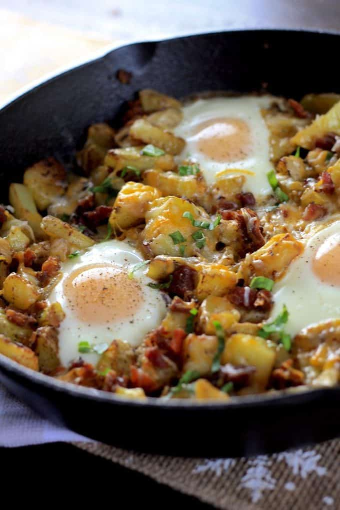

## Baked eggs with Potatoes and Bacon

[Original Recipe](https://laughingspatula.com/skillet-baked-eggs-with-potatoes-bacon/)

** Prep time: XX minutes || Cook time: XX minutes || Serving: 1 || Rating X/10 **

### Ingredients

- 3 potatoes, chopped and boiled
- 2 eggs
- 2 thick-slices bacons
- salt and pepper
- 

### Instructions

1. Roast the boiled chopped potatoes at 375F for about 40 minutes or until golden brown. 
2. At the same time bake the bacons for about 30 minutes or fry them in a pan until golden brown. 
	- When the bacons are ready, crumbled the bacon into pieces.
3. When the potatoes and bacons are ready, cook over-easy eggs in a frying pan. 
4. Mix all the ingredients together ina bowl by the ratio you prefer. salt and pepper to taste. 

