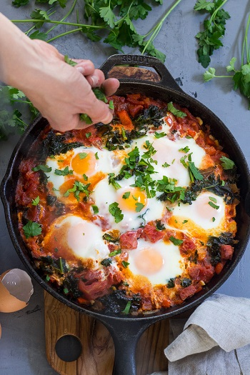

## Shakshuka

[Original Recipe by Michele from Paleo Running Momma](https://www.paleorunningmomma.com/shakshuka-kale-sausage-paleo-whole30/)

** Prep time: 10 minutes || Cook time: 30 minutes|| Total time: 40 minutes || Serving: 4-6 || Rating 10/10 **

### Ingredients

- 1 tablespoon cooking fat (butter, ghee, oil)
- 1 small onion, diced
- 1-2 red bell pepper, diced
- 3-4 cloves garlic, minced
- 2 chorizo or andouille sausage pre-cooked, chopped or ground (optional)
- 28 oz can peeled plum tomatoes half drain and tomatoes roughly chopped
- 1 tsp chili powder
- 3/4 tsp paprika
- 1/2 tsp cumin
- Dash cayenne, (optional for extra heat)
- handful of baby spinach/kale, roughly chopped
- 6 eggs
- Salt and pepper, to taste
- Fresh parsley, chopped (for garnish)

### Instructions

1. Preheat your oven to 400F  (to bake the eggs at the end). 
2. In a large skillet, add the oil over medium heat.
3. Add the onions and cook until the onions are translucent. 
4. Add the bell peppers peppers, and for a few minutes. 
5. Add the garlic and sausage. Cook and stir until the sausage begins to brown (about 2-3 min.).
6. Add the tomatoes and spices and simmer for 5-8 min. until the sauce thickens.
7. Stir in the chopped spinach and cook until they wilts.
8. Create 6 divots in the mixture (evenly space) and slide gently each egg right into the skillet, careful not to break the yolks.
	- To easily slide the egg intact, crack one egg at a time into a small bowl/1 cup dry measuring cup, and then pour it gently into the divots.
9. Sprinkle the eggs with salt and bake in the oven for 10-15 min. until eggs are cooked to preference. 
10. Garnish with chopped parsley before serving hot. 

Serve alone or with potatoes for a filling meal.

### Notes
- If you are omitting the sausages from the recipe; adjust the amount of garlic to your liking (reduce if you don't like too much garlic).
