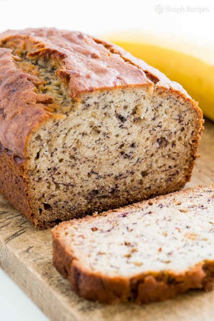

## Banana Bread

[Original Recipe by Elise Bauer](https://www.simplyrecipes.com/recipes/banana_bread/)

** Prep time: 10 minutes || Cook time: 55 minutes || Serving: one loaf || Rating 10/10 **

### Ingredients

- 2 to 3 very ripe bananas, peeled (about 1 1/4 to 1 1/2 cups mashed)
- 1 1/2 cups of all-purpose flour
- 1/3 cup melted butter, unsalted or salted
- 1 teaspoon baking soda
- Pinch of salt
- 1/2 cup sugar (cane sugar etc.)
- 1 large egg, beaten
- 1 teaspoon vanilla extract
- 1/4 cup chopped walnuts or chocolate chips (Optional)

### Instructions

1. Preheat the oven to 350°F, and butter a 4x8-inch loaf pan.
2. In a mixing bowl, mash the ripe bananas with a fork until completely smooth. Stir the melted butter into the mashed bananas.
3. Mix in the baking soda and salt. Stir in the sugar, beaten egg, and vanilla extract. Mix in the flour.
4. Pour the batter into your prepared loaf pan. Add the chopped walnuts or chocolate chips and mix well. 
5. Bake for 50 minutes to 1 hour at 350°F, or until a tester inserted into the centre comes out clean.
6. Remove from oven and let cool in the pan for a few minutes. Then remove the banana bread from the pan and let cool completely before serving. 

Slice and serve.

