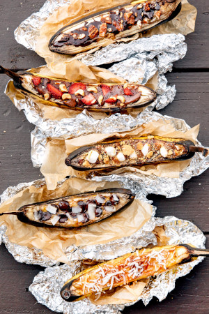

## Indoors Campfire Treats

### 1. Banana Boat

** Prep time: 5 minutes || Cook time: 10 minutes || Serving: 1 banana boat

#### Ingredients

** For classic Banana Boat **

- banana, don't remove the peel
- chocolate, peanut butter or/and caramel chips
- mini marshmallows

** Other Banana Boat Fillings **

 - Strawberry hazelnut: Banana + Strawberries + Nutella + Chopped Hazelnuts
 - Samoas: Banana + Chocolate Chips + Caramel Sauce + Toasted Coconut
 - Dulce de leche: Banana + Chocolate chips + Dulce de Leche sauce + Coconut shreds
 - PB and Chocolate: Banana + Peanut Butter + Chocolate Chips
 - Honey ginger: Banana + Honey + Candied Ginger + White or Dark Chocolate
 - Banana split: Banana + Milk Chocolate chips + Marshmallows + Cherries
 - Pecan praline: Banana + Pralines + Dark Chocolate chips

#### Instructions

1. Preheat the oven at 350F.
2. Take a banana with its peel still on and cut it down the middle (along the concave side). Not all the way through, but until the tip of your knife just grazes the peel on the other side. Pull the peel and banana slightly apart. Cut the tail end so it don't fall over while baking.
3. Stuff the chocolate chips and mini marshmallows (or other fillings) into the centre of the banana.
4. Put the banana on a baking sheet and bake for about 10 minutes or until fillings are warm and marshmallow are golden. 
	
Note: If cooking over a campfire or a grill, wrap the banana in foil and cook until fillings have melted and banana has warmed through, about 10 minutes.
 

