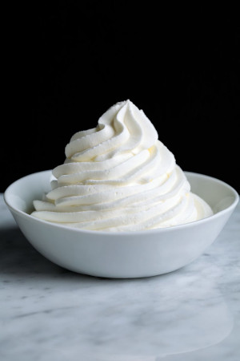

## Coconut Whipped Cream

[From the Fuss-Free Vegan Cookbook](https://www.amazon.ca/s?k=fuss+free+vegan&crid=2QXY700P3THUW&sprefix=fuss+fr%2Caps%2C-1&ref=nb_sb_ss_i_1_6)

** Prep time: 5 minutes + overnight pre-chill of coconut milk || Serving: 1 1/4 cups || Rating X/10 **

### Ingredients

- 1 can coconut cream (or premium coconut milk)
- 2 Tbsp icing sugar
- 1 tsp vanilla
- 1-4 Tbsp non-dairy milk (as required to achieve desired consistency)

### Instructions

1. Chill coconut milk overnight in fridge.
1. Scoop coconut cream, as well as icing sugar, and vanilla into bowl of mixer.
1. Beat until light and fluffy, adding milk as required.
1. Store in an air-tight container in the fridge for up to one week.

