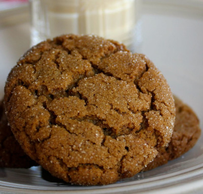

## Gingersnap cookies (Gluten-Free)

[Original Recipe by The Spruce Eats](https://www.thespruceeats.com/gluten-free-gingersnap-cookie-recipe-1450950)

** Prep time: 10 minutes || Cook time: 10 minutes || Serving: 30 cookies || Rating X/10 **

### Ingredients

- 6 tablespoons butter (unsalted, at room temperature or dairy-free Spectrum organic vegetable shortening at room temperature)
- 3/4 cup brown sugar (pressed firmly into measuring cup)
- 1 large egg
- 1/4 cup molasses (unsulphured)
- 1/2 teaspoon vanilla extract
- 127 grams garbanzo bean flour (about 1 cup)
- 140 grams sweet sorghum flour (about 1 cup)
- 2 teaspoons ginger (ground)
- 1 1/2 teaspoons cinnamon (ground)
- 1/4 teaspoon cloves (ground)
- 1/4 teaspoon nutmeg (ground)
- 1/2 teaspoon salt (kosher)
- 1/2 teaspoon baking powder
- 1/2 teaspoon baking soda
- 1/4 cup sugar (granulated cane, to roll dough balls in prior to baking)

### Instructions

1. In a large mixing bowl, use an mixer to cream the butter and brown sugar. Add the egg, molasses, and vanilla and beat until combined.
2. In a separate bowl, mix the flours, spices, salt, baking powder, and soda. Whisk to thoroughly blend. Add the dry ingredients to the wet ingredients. Mix until combined and smooth. The batter will be thick.
3. Cover bowl and chill cookie dough in the refrigerator for about 1 hour. 
	- Or place dough in an airtight container and refrigerator for several days.
4. Preheat oven to 350 F / 176 C while you shape the cookie dough for baking.
5. For easy, uniform cookies, use a spring-loaded 1-tablespoon-size ice cream scoop to shape cookies. Otherwise, use a tablespoon to scoop dough and roll into balls. Roll each ball in granulated sugar and place balls about 2 inches apart on the line baking sheets.
5. Bake in preheated oven for about 10 minutes. Be careful not to overbake cookies. They should crack on the surface but still be slightly soft in the middle when done. 
6. Cool the cookies on the baking sheet for about 5 minutes and then use a spatula to place cookies on a cooling rack.​

Enjoy your exquisite cookies warm or cooled.

