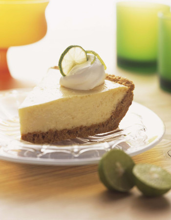

## Gingersnap Pie Crust (Gluten-Free)

[Original Recipe from The Spruce Eats](https://www.thespruceeats.com/gingersnap-pie-crust-482023)

** Prep time: 10 minutes || Cook time: 10 minutes || Serving: 1 || Rating 9/10 **

### Ingredients

- 1 1/2 cups ​​[gingersnap cookies](../desserts/gf_gingersnap_cookies.md) (crumbled)
- 3 tablespoons brown sugar
- 1/2 teaspoon ground ginger
- 6 tablespoons butter (melted)

### Instructions

** Bake Method **

1. Preheat the oven to 350 F.
2. Combine the cookie crumbs, brown sugar, ground ginger, and melted butter in a medium bowl until you can pick up some of the mixture and press it into a ball that holds together.
3. Press the crumb mixture into a greased 9-inch pie pan. Bake at 350 F for 10 minutes, until the crust is set. Remove the pie crust from the oven and cool completely on a wire rack before filling with cooked fruit, ice cream, pudding, or anything you would like.

** No-Bake Method: **

- Instead of baking the pie crust to set it, freeze it for 30 minutes or so before filling it and be sure to chill your pie thoroughly after filling.

** Other Cookie Crusts: **

- Follow the basic proportions of cookie crumbs to sugar and melted butter. Omit the ginger if you are using other types of cookies. You could substitute ground cinnamon or nutmeg in place of the ginger if you would like.

