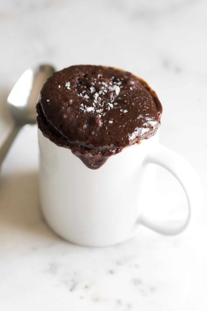

## Mug Brownies

### Instructions

1. Add every ingredients BUT NOT the flour. Mix everything well.
2. Add the flour and mix everything well. The right consistency should look like Elmer's glue. If it's too runny, add more flour. If it's too dry, add some oil/butter or some milk.
3. To obtain moist brownies: microwave it about 40 seconds. It is ready when the mixture finish rising. Stop immediately. 
To obtain Denser brownies: microwave it about 45 seconds. It is ready when the mixture finish rising and stop after 5 second.

Enjoy!

### 1. Peanut Butter Chocolate Brownies

** Ingredients **

- 1 heaping tablespoon Peanut Butter
- 1 heaping tablespoon Cocoa powder
- 3 tablespoons olive oil or melt butter
- 1 egg
- 1 tablespoon maple syrup
- 1 teaspoon vanilla
- 1/4 teaspoon baking powder
- dash of salt
- 3 tablespoon of flour

### 2. Peanut Butter Blondie

** Ingredients **

- 1 heaping tablespoon Peanut Butter
- 3 tablespoons olive oil or melt butter
- 1 egg
- 1 tablespoon maple syrup
- 1 teaspoon vanilla
- 1/4 teaspoon baking powder
- dash of salt
- 3 tablespoon of flour

### 3. Chocolate Brownies

** Ingredients **

- 2 tablespoons Cocoa powder
- 3 tablespoons olive oil or melt butter
- 1 egg
- 1 tablespoon maple syrup
- 1 teaspoon vanilla
- 1/4 teaspoon baking powder
- dash of salt
- 3 tablespoon of flour

### 4. Blondie

** Ingredients **

- 3 tablespoons olive oil or melt butter
- 1 egg
- 1 tablespoon maple syrup
- 1 teaspoon vanilla
- 1/4 teaspoon baking powder
- dash of salt
- 3 tablespoon of flour

### 5. Keto/Gluten-free Brownies

** Ingredients **

- Instead of all purpose flour, add 3 tablespoons almond flour and 1 teaspoon of coconut flour
- Choose a previous selection for all the other ingredients

