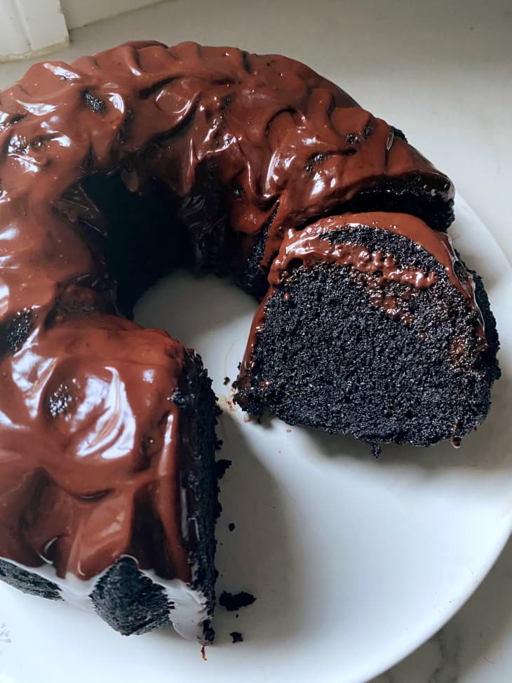

## Nana Devil's Food Cake

[Original Recipe by Grace Elkus](https://www.thekitchn.com/reddit-nanas-devils-food-cake-23097803)

** Prep time: 15 minutes || Cook time: 45 minutes || Rating 10/10 **

### Ingredients

** Cake ** 

- 2 cups all purpose flour
- 1 1/4 teaspoon kosher salt
- 1 teaspoon baking powder
- 2 teaspoons baking soda
- 3/4 cup unsweetened cocoa powder
- 2 cups granulated sugar
- 1 cup vegetable oil
- 1 cup whole milk
- 1 cup coffee beans (cooled by not cold)
- 2 large eggs
- 1 teaspoon vanilla

** Chocolat chips frosting **

- 1 cup semi-sweet chocolat chip
- 1 cup butter room temperature
- 2 cups powdered sugar
- 2 teaspoons vanilla extract

### Instructions

1. I started by sifting together 2 cups flour (I used all-purpose), 1 1/4 teaspoons kosher salt (the recipe calls for 1 teaspoon, but I assumed it was referring to fine salt, so I scaled up for kosher), 1 teaspoon baking powder, 2 teaspoons baking soda, 3/4 cup cocoa powder, and 2 cups granulated sugar. The only cocoa I had on hand was this jet black cocoa, which is why mine turned out so dark, but any unsweetened cocoa would work. Both my cocoa and my sugar had some lumps in them, so I was happy I took the time to sift the mixture. 

2. I then whisked together 1 cup vegetable oil, 1 cup whole milk, 1 cup coffee (cooled but not cold, as the recipe specifies), 2 large eggs, and 1 teaspoon vanilla. Using a rubber spatula, I slowly folded the dry ingredients into the wet. After looking through the cakes fellow Redditors had made, I decided to bake mine in a Bundt pan. I greased it with melted butter and sprinkled it with cocoa powder, poured in the batter, and baked at 350°F in the center of my oven until a toothpick came out clean, 40 to 45 minutes. (The original recipe says 375°F, but after reading through the comments and trusting my own baking instincts I baked at 350°F). 

3. Chocolate chips frosting:
	- Place the chocolate chips in a glass bowl and microwave them for 90 seconds, at 50% power, stir and microwave again for 30 seconds at 50% power. Stir until smooth. (The chocolate can also be melted in a glass bowl over a simmering pan of water on the stove. Use whichever method works for you, just melt it slowly, until the chocolate is smooth.)
	- Let cool to almost room temperature, do not skip the cooling step.
	- Beat the butter with an electric mixer on medium speed until smooth. Add 1 cup of powdered sugar and beat again. Scrape the sides with a spatula and add the remaining powdered sugar. Continue beating for about a minute, scraping the sides as needed, until the mixture is smooth and creamy.
	- Add the vanilla and the cooled chocolate and beat on high for about 2 minutes, scraping the sides as necessary, until the frosting is creamy, smooth, and very fluffy. Spread across the cake of your choice, or just grab a spoon.

Note: This cake is incredibly versatile and hard to mess up, so consider it a blank slate. It’s been baked into cupcakes and layer cakes and even coffin-shaped cakes,turned into a Black Forest Cake, add walnut in it and slathered with salted caramel or peanut butter frosting, or cream cheese, just to name a few. 
