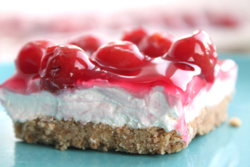

## No Bake Cherry Cheesecake

** Prep time: 15 minutes || Serving: 20 || Rating 10/10 **

### Ingredients

- 2 cups Graham or Oreo Baking Crumbs
- 1/2 cup melt butter
- 2 tablespoons sugar
- 1 envelope of dream whip or 250g of Whipped Topping
- 1 cup powdered sugar
- 1 package (250g) cream cheese, softened
- 1/2 teaspoon vanilla extract
- 1 can (540 mL) cherry pie filling
- 9 inch baking dish

### Instructions

1. Butter/spray the bottom and sides of the pan. 
2. In the pan, mix the baking crumbs, melted butter and sugar. Press it onto the bottom of the dish. Set aside.
3. On low speed, beat the cream cheese slightly. Add the powdered sugar and vanilla. Beat until there are no lumps. 
4. Add half of the dream whip and mix until blended. Add the rest of the whip and mix until well-blended. 
5. Evenly space the cream cheese mixture over the crust and gently spread ad evenly smooth out the back of the spoon over the entire crust.
6. Add the cherry pie filling by spooning it out slowly and evenly over the top of the whole cheesecake.
7. Cover with a tight-fitting lid or plastic wrap.
8. Refrigerate at least two hours or until ready to serve.

Serve cold. 

Note: Adding fresh berries on top with the cherry filling such as raspberries, strawberries and blueberries add a nice touch.
