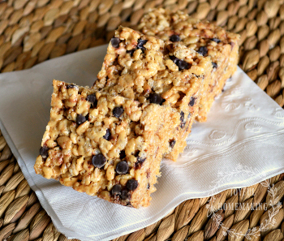

## Chocolate and Peanut Butter Rice Krispies

** Prep time: 5 minutes || Cooling: 30 minutes || Serving: 24 || Rating 10/10 **

### Ingredients

- 1/4 cup (mL) butter
- 4 cups (250g) regular size marshmallow 
- 1/2 teaspoon (2 mL) vanilla extract (optional)
- 6 cups Rice Krispies cereal
- 1/2 cup chocolate chips
- 1/2 cup smooth peanut butter

### Instructions

1. Melt butter in a large saucepan over low heat. Add marshmallows and stir until melted and well blended. Remove from the heat. 
2. Stir in vanilla extract. Add in rice krispies cereal and stir until coated. 
3. Add the chocolate chips and peanut butter chips and stir in. 
4. Butter the 13" by 9" baking dish. With a lightly buttered spatula press the coated rice krispies into the dish. 
5. Cool until set for at least 30 minutes. Cut into squares. 

Store the rice kirspies squares into a seal container. 
