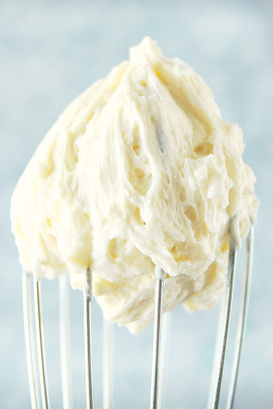

## Frosting Type for Cake and Cupcake

[From the Fuss-Free Vegan Cookbook](https://www.amazon.ca/s?k=fuss+free+vegan&crid=2QXY700P3THUW&sprefix=fuss+fr%2Caps%2C-1&ref=nb_sb_ss_i_1_6)

### 1. Vanilla Frosting

** Prep time: 5 minutes || Serving: 3 cups || Rating X/10 **

** Ingredients **

- 1/2 vegetable shortening
- 1/2 cup vegan butter
- 3 cups icing sugar - try with 1.5 or 2?
- 1 tsp vanilla
- 1-4 Tbsp non-dairy milk (as required to achieve desired consistency)

** Instructions **

1. Cream together shortening and butter in a stand mixer.
1. Mix in icing sugar and vanilla until whipped and creamy.
1. Add as much milk is required to get the desired consistency.
1. Store in an air-tight container in the fridge for up to one week, or freeze.

### 2. Chocolate Frosting

** Prep time: 5 minutes || Serving: 3 cups || Rating X/10 **

** Ingredients **

- 1/2 vegetable shortening
- 1/2 cup vegan butter
- 1 1/4 cups icing sugar
- 1/4 cup cocoa powder
- 1 tsp vanilla
- 1-2 Tbsp non-dairy milk (as required to achieve desired consistency)

** Instructions **

1. Cream together shortening and butter in a stand mixer.
1. Mix in icing sugar, cocoa powder, and vanilla until whipped and creamy.
1. Add as much milk is required to get the desired consistency.
1. Store in an air-tight container in the fridge for up to one week, or freeze.

### 3. Cream Cheese Frosting

** Prep time: 5 minutes || Serving: 3 cups || Rating X/10 **

** Ingredients **

- 1/2 vegetable shortening
- 1/2 cup vegan butter
- 3 cups icing sugar - try with 1.5 or 2?
- 1 Tbsp apple cider vinegar
- 2 tsp vanilla
- 1 tsp lemon juice
- 1-4 Tbsp non-dairy milk (as required to achieve desired consistency)

** Instructions **

1. Cream together shortening and butter in a stand mixer.
1. Mix in icing sugar, apple cider vinegar, lemon juice, and vanilla until whipped and creamy.
1. Add as much milk is required to get the desired consistency.
1. Store in an air-tight container in the fridge for up to one week, or freeze.
