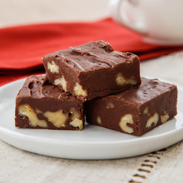

## Vegan Chocolate Fudge

[From the Fuss-Free Vegan Cookbook](https://www.amazon.ca/s?k=fuss+free+vegan&crid=2QXY700P3THUW&sprefix=fuss+fr%2Caps%2C-1&ref=nb_sb_ss_i_1_6)

** Prep time: 60 - 180 minutes to set || Cook time: 5 minutes || Serving: 12 pieces || Rating X/10 **

### Ingredients

- 1 cup full-fat coconut milk
- 3 cups chocolate chips (dairy-free)
- 2 cups icing sugar
- 1 Tbsp espresso powder (optional)
- 1 cup walnuts or pecans, roughly chopped (optional)

### Instructions

1. Line a 8- x 8-inch pan with parchment paper, so that is hangs over the sides to make handles
1. Heat coconut milk in saucepan over medium heat until it comes to a boil.
1. Lower heat, and whisk in chocolate chips.
1. As soon as the chips have melted, remove from heat, and add icing sugar.
1. Blend with immersion blender until completely smooth.
1. Mix in optional ingredients if using.
1. Pour mixture into prepared pan, and chill in fridge for 3 hours, or freezer for 1 hour to firm up.
