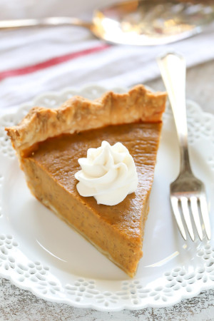

## Vegan Pumpkin Pie

[From the Fuss-Free Vegan Cookbook](https://www.amazon.ca/s?k=fuss+free+vegan&crid=2QXY700P3THUW&sprefix=fuss+fr%2Caps%2C-1&ref=nb_sb_ss_i_1_6)

** Prep time: 5 minutes || Cook time: 60 minutes + 4 hours or overnight chill || Serving: 6-8 || Rating X/10 **

### Ingredients

- 1 [Pie Crust]('')
- 1 can (14 oz) pumpkin puree
- 3/4 cup full-fat coconut milk
- 1/2 cup brown sugar, packed
- 1/4 cup maple syrup
- 1/4 cup cornstarch
- 2 tsp pumpkin spice (or 1/2 tsp each cinnamon, cloves, nutmeg, ginger)
- 1 tsp vanilla
- 1/2 tsp salt

### Instructions

1. Preheat oven to 350. Place pie crust in 9 inch pie plate
1. Add all other ingredients to blender, and mix well.
1. Pour mixture in pie crust, and bake for 60 minutes.
1. Remove from oven, and cool at room temperature. 
1. Chill, uncovered, in fridge for at least 4 hours, or overnight.
1. Serve with [whipped cream](coconut_whipped_cream.md)
