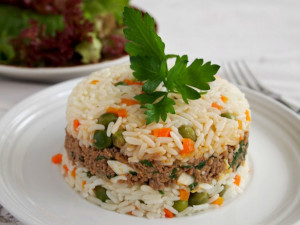

## Arroz Tapado (Rice on Top)

[Original Recipe](https://perudelights.com/arroz-tapado-the-lazy-cooks-favourite/)

** Prep time: 30 minutes || Cook time: 35 minutes || Serving: 4 || Rating 10/10 **

** Recipe may varied with what ingredients is on hand and personal preference. It up to the cook to decide the ratio of proteins, vegetables or herbs are added. **

### Ingredients

- 1/4 cup olive oil
- 1 sweet onion, diced
- 2 garlic cloves, minced
- 1 tablespoon tomato paste
- 1 lbs proteins (ground beef/chicken,
- 1/4 cup of fresh parsley, chopped
- 1/4 cups green peas
- 2 large carrots, diced
- 4-5 tomatoes, optional (to make a sauce)
- salt and pepper
- white rice, cooked

** Optional: **

**	- vegetables: **
	black olives,
	corn,
	sweet potato,
	fried plantains
	
**	- protein: **
	hard-boiled eggs,
	ground/finely chopped beef, chicken or tuna,
	portobellos,
	sausages
	
**	- other: **
	raisins,
	cumin, paprika, oregano
	
### Instructions

1. Cooked white rice according to package instruction. 
2. Heat the oil in a pan over medium-high heat.
3. Sauté the onion until soft and translucent. 
4. Sauté garlic for 30 seconds. Then add tomato paste and stir for a few minutes. 
5. Add ground beef and cook for about 15 minutes over medium-low heat, stirring every now and then. 
	- If the mixture looks dry, add some water, about 1/2 cup.
6. Add vegetables and cook for about 7 minutes. 
7. Optional: When ready, add raisins, black olives, hard-boiled eggs, and parsley. Turn off the heat.
8. Make the sauce: In a blender put in the tomatoes and then pour it in a pot over medium-high heat. You can add to the sauce some honey, maple or cane sugar to make it slightly sweeter.

** To Serve: **

In the bottom of a ramekin or bowl, make a layer of rice, pressing with a spoon. Over this make a layer of the ground beef mixtures, and cover with more rice. Put a plate over the ramekin and turn up-side-down. Take out the ramekin. IF using a sauce, put some sauce over the arroz tapado. Serve with a green salad.

Note: You can cook the vegetables with the rice instead of with the meat.

