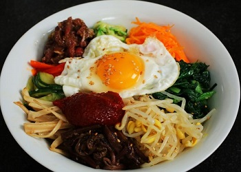

## Bibimbap (Rice mixed with vegetables, meat, egg, and chili pepper paste)

[Original Recipe by Maangchi](https://www.maangchi.com/recipe/bibimbap)

 

** Serving: 4 || Rating 9/10 **

### Ingredients

- 5 cups cooked rice (2 cups of dried rice)
- 12 ounces soy bean sprouts, washed and drained
- 8 ounces of spinach blanched and washed with the excess water squeezed out by hand
- 1 large carrot
- 1 large red bell pepper
- 1 large zucchini
- 1 English cucumber
- 3 to 4 green onions, chopped
- ½ pound fresh lean cut of beef (any kind of meat you have in your hand)
- 4 eggs
- salt
- vegetable/olive oil
- sesame oil
- sesame seeds
- garlic
- soy sauce
- honey 
- Korean hot pepper paste (gochujang)

### Instructions

1. Soybean sprouts:
	1. Put the soy bean sprouts in a pot and add 4 cups water and 2 or 3 teaspoons salt. Cover and cook for 20 minutes over medium high heat. Take out the sprouts with tongs and put them into a bowl, leaving about ½ cup of sprouts in the pot with the water you used to boil them. This is the soup to serve with bibimbap later.
	1. In a bowl, mix the sprouts by hand with ½ teaspoons salt, 1 teaspoon minced garlic, and 2 teaspoons sesame oil. Put it aside.

2. Spinach:
	1. Cut up the blanched spinach a few times and put it in a bowl. Mix by hand with 1 teaspoon garlic, 1 teaspoon sesame oil, ½ teaspoon salt, and 1 teaspoon sesame seeds. Put it aside.

3. Other fresh vegetables:
	1. Cut the carrot into matchsticks, put them in a bowl, and mix with a pinch of salt. Let stand for 5 to 10 minutes until sweating.
	1. Cut the red bell pepper into halves, deseed, and slice into strips. Put them in a bowl.
	1. Cut the zucchini into matchsticks and mix with ½ teaspoon salt.
	1. Cut the cucumber into halves lengthwise and slice thinly crosswise. Mix with ¼ teaspoon salt.

4. Meat: 
	1. Cut the meat into matchsticks and put them in a bowl.
	1. Mix with 1 tablespoon minced garlic, 1 tablespoon soy sauce, 1 tablespoon honey, 2 teaspoons sesame oil, and 1 teaspoon sesame seeds with a spoon. Put it aside.
	
6. Cooking: 
	1. Heat up a pan over medium high heat. Squeeze out excess water from the carrot. Add a few drops of cooking oil to the pan and sauté the carrot for 1 minute. Put it aside.
	1. Add a few drop of olive oil in the pan and squeeze out the excess water from the cucumber. Sauté with ½ teaspoon minced garlic and a few drops of sesame oil for 30 seconds. Put it aside.
	1. Add a few drop of olive oil in the pan. Add the red bell pepper and sprinkle a pinch of salt over top. Sauté for 30 seconds. Put it aside.
	1. Add a few drop of olive oil in the pan and squeeze out excess water from the zucchini. Sauté with 1 teaspoon minced garlic, 1 tablespoon chopped green onion, a drop of sesame oil for 1 minute until slightly softened. Put it aside.
	1. Fry up sunny side up or over easy eggs on medium high heat. 
	
7. To serve:
	1. Add half a bowl of rice (about 1 1/2 cups), an egg, meats, spinachs, sprouts, carrots, bell peppers, zucchini and cucumber as you see fit. 
	2. Mix it all in your bowl and enjoy!
