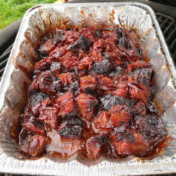

## Brisket Burnt Ends

[Original Recipe](https://www.learningtosmoke.com/brisket-burnt-ends/)

** Prep time: 15 minutes || Cook time: 1h30 minutes || Serving: 10 || Rating 10/10 **

### Ingredients

- 1 brisket point, fully cooked (point can be from full brisket)
- 1 Cup BBQ sauce
- 4 tablespoons butter
- 1 tablespoon rub
- 2 teaspoons honey
- 3 oz Dr Pepper / cola / water / broth
- 1 teaspoon Worcestershire sauce

### Instructions

1. Preheat grill/smoker to 275F.
2. Cook the full brisket, separating the point and flat when done. Slice the point into 1 - 1 1/2 inch cubes and place in foil pan
3. In the foil pan, combine rub, BBQ sauce, Worcestershire sauce, butter, honey, and liquid with the brisket cubes. Mix in pan and put sheet of foil over it.
4. Place on grill/smoker and let it cook for one hour. 
5. Remove foil and cook uncovered for another 30-45 minutes.
6. Remove from grill, rest for about 10-15 minutes before serving.

### Notes 

** THE FULL BRISKET WILL NEED TO BE COOKED PRIOR TO MAKING BURNT ENDS **

- After burnt ends have cooked for an hour and you unwrap the foil, feel free to drain some of the excess juices in the foil pan

- Make sure the burnt ends render when you give them a squeeze.

- Aim to have them be a little sticky.

