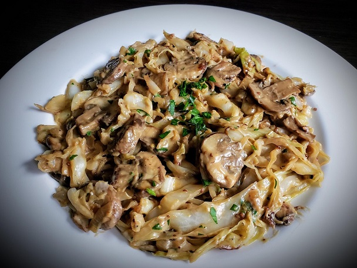

## Cabbage Stroganoff

[Original Recipe](https://www.reddit.com/r/veganrecipes/comments/c0d5fp/cabbage_stroganoff_heres_a_simple_and_quick_lunch/)

** Prep time: 10 minutes || Cook time: 30 minutes || Serving: 4 || Rating 9.5/10 **

### Ingredients

- 14 oz Cabbage, thinly sliced
- 8 oz Mushrooms, sliced
- 12 oz Protein (e.g. chicken, sliced tofu, TVP, or crumbled tempeh)
- 1 onion, thinly sliced
- 2 cloves garlic, minced
- 3 tablespoons olive oil
- 1 tablespoon flour
- 1/4 cup white wine (substitution: broth)
- 1 cup broth
- 1 tablespoon dijon mustard
- 1 tablespoon Worcestershire sauce
- 1/3 cup coconut milk (or milk & tapioca)
- 2 tablespoons fresh parsley, chopped
- Salt & pepper to taste

### Instructions

1. Add oil in a large skillet over medium high heat. 
2. Protein: 
	- If use uncooked chicken: cook your chicken (1 inch cube) in a skillet. 
	- If use tofu, either pan fry in a skillet or bake it at 375F until golden.
3. Saute cabbage, mushrooms, onions and garlic for approximately 10 minutes. Season well with salt & pepper. 
	- if you prefer the cabbage to be crunchy: follow step 3. 
	- if you prefer a softer cabbage: saute it alone for 5 minutes before adding mushrooms, onions and garlic.
4. Mix in the protein, and fry for 1 to minutes to heat through.
5. Add white wine and allow alcohol to cook off, approximately 1 to 2 minutes.
6. Sprinkle flour over vegetables, mix in and continue to cook for 2 minutes.
7. Add broth, dijon mustard and worchestire. Cook until broth thickened, approximately 2 to 3 minutes.
8. Reduce heat to low. Mix in the cream. Cook until heated through.
9. Remove from heat. Stir in chopped parsley before serving.

_Tags: dairy-free, lunch, dinner, main_