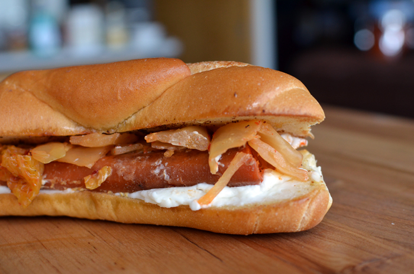

## Carrot Dogs

[From the Fuss-Free Vegan Cookbook](https://www.amazon.ca/s?k=fuss+free+vegan&crid=2QXY700P3THUW&sprefix=fuss+fr%2Caps%2C-1&ref=nb_sb_ss_i_1_6)

** Prep time: 5 minutes + up to 2 days extra marinating, if desired || Cook time: 20 minutes || Serving: 4-6 || Rating X/10 **

### Ingredients

- 4-6 hotdog-sized carrots, peeled, trimmed, and shaped to look like hotdogs
- 2 cups water
- 3 Tbsp soy sauce
- 1 tsp paprika
- 1/2 tsp garlic powder
- 1/2 tsp onion powder
- 1/2 tsp dried mustard
- 1/2 tsp pepper
- 1/2 tsp salt
- 4-6 hotdog buns
- Your favourite toppings

### Instructions

1. Choose a sauce pan just wide enough to fit the carrots in a single layer. Whisk together all ingredients except the carrots.
1. Add, the carrots, and bring to a simmer for 10-15 minutes, so that the carrots are cooked, but not mushy.
1. If desired, allow the carrots to cool in the marinade, and store in the fridge for up to two days to allow flavours to develop.
1. Grill or pan-fry the carrots
	- Grill: place on hot BBQ, and cook until grilled on all sides
	- Pan: preheat 1 Tbsp olive oil in a pan over medium heat. Add the carrots, and fry until browned on all sides, about 5 minutes.
1. Serve on a hotdog bun, topped the way you want.
