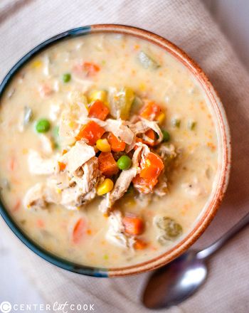

## Chicken a la King Pasta Casserole

[Original Recipe by Ashley Wagner](https://www.centercutcook.com/slow-cooker-healthy-chicken-pot-pie-stew/)

** Prep time: 15 minutes || Cook time: 1 or 4 hours || Serving: 6 || Rating 9/10 **

### Ingredients

- 1 lb. chicken breasts (boneless and skinless), cubes
- 1 large yellow onion, diced
- 3 stalks celery, diced
- 3 carrots, diced
- 3 cloves garlic, minced
- 1 1/2 teaspoons kosher salt
- 1 teaspoon ground black pepper
- 1 teaspoon dried thyme
- 1 teaspoon dried oregano
- 3 1/2 cups chicken broth
- 1 bay leaf
- 1/3 cup frozen corn kernels
- 1/3 cup peas
- 1/2 cup yogourt, plain (e.g coconut, almond, greek)
- Noodle pasta

### Instructions

#### Sauce 

** Stove-Top: **

1. In a large pot, combine all the ingredients BUT the corns, peas and yogourt. Mix well.
2. Cover, and cook on medium-high heat, or until the chicken is cooked through and the vegetables are tender.
3. Remove and discard bay leaf.
4. With the immersion blender, blend about 2 cups of liquid and contents.
	- or take out about 2 cups from the pot and blend it with a blender until smooth. Then return it the the pot.
	- This will serve to thicken the stew.
6. Add the frozen, peas, corn kernels and yogourt.
7. Re-cover and cook on medium-high heat, until the frozen vegetables have heated through. 
8. Season to taste before serving.

** Slow cooker or Instant Pot: **

1. In a cooker pot, combine all the ingredients BUT the corns, peas and yogourt. Mix well.
2. Cover, and cook on Low for 4-5 hours, or until the chicken is cooked through and the vegetables are tender.
3. Remove and discard bay leaf.
4. With the immersion blender, blend about 2 cups of liquid and contents.
	- or take out about 2 cups from the pot and blend it with a blender until smooth. Then return it the the pot.
	- This will serve to thicken the stew.
6. Add the frozen, peas, corn kernels and yogourt.
7. Re-cover and cook an additional 30 minutes, until the frozen vegetables have heated through. 
8. Season to taste before serving.

#### Casserole

1. After making the chicken a la king sauce, boil 1 lbs of pasta noodles according to package directions.
1. In a casserole dish, add the noodles and an appropriate amount of Chicken a la king sauce. Mix well.
1. In a preheated oven at 375F, bake the casserole until ready bubbling and starting to brown (about 30 minutes).

