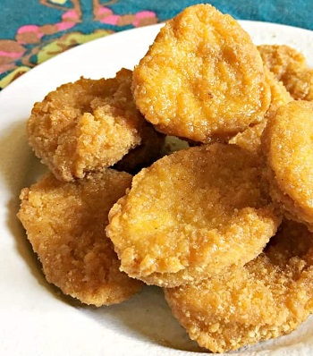

## Chicken Nuggets

### 1. Paleo Chicken Nuggets

[Original Recipe from The Coconut Mama](https://thecoconutmama.com/grain-free-nourishing-chicken-nuggets/)

** Prep time: 15 minutes || Cook time: 1 hours || Serving: 32 smalls || Rating X/10 **

#### Ingredients

- 2 Whole Chicken Breasts, bones removed
- 2+ Chicken Livers, from whole chicken (optional)
- 1 teaspoon Salt
- 1/2 teaspoon Parsley flakes
- 1/4 teaspoon Onion powder
- 1/4 teaspoon Pepper
- 2 Eggs, beaten
- 1 to 1 1/2 cups arrowroot powder
- 1/2 teaspoon salt
- Pinch black pepper
- 1/4 cup melted fat (oil/butter/lard/tallow) (if baking) or frying oil (if frying)

#### Instructions

1. Use a meat grinder to process the chicken breasts and livers into ground meat into a "paste".
	- You have to passed the ground meat twice or three time through the meat grinder before it become a paste.
	- Really work the meat and mash it otherwise it will become a meatball instead of a nugget.
2. Add seasoning and mix well.
3. Roll meat paste into nugget size pieces (half the size of a golf ball) and place on a baking sheet.
4. In one medium side dish, mix in the arrowroot flour, salt and pepper. 
5. In the second medium side dish, add beaten eggs.
6. Dip nuggets in egg mix and then into the arrowroot flour mix. Coat well and place back on cookie sheet. Continue until all the chicken nuggets are breaded.
	- If you would like to freeze the chicken nuggets, do so at this point. Place cookie sheet in freezer until nuggets are frozen on the outside (for about 45 minutes) and place the nuggets in freezer friendly container.
7. Cook the nuggets:
	- Bake: 
		1. Preheat the oven at 350 F.
		2. Spread some oil/butter/lard/tallow over chicken nuggets. 
		3. Bake until they are cooked through (about 1 hour). Flip nuggets half way through cooking. 
			- For frozed nuggets, it may need more time to cook. 
	- Frying: 
		1. Preheat the frying oil to around 370°F (185°C). 
		2. Place the nuggets in the fryer for approx 10 minutes, turning once. Don't overcrowd the fryer at this point!
		3. Take the nuggets out of the fryer and leave on a paper towel to drain for a couple of minutes.

Serve and enjoy!

### 2. Chicken Nuggets

[Original Recipe by FastFood Recipes](https://fastfood-recipes.com/recipes/mcdonalds/mcdonalds-chicken-nuggets-copycat-recipes/)

** Prep time: 15 minutes || Cook time: 1h20 minutes || Serving: 10-12 smalls || Rating X/10 **

#### Ingredients

- 4 chicken breast fillets
- 1 cup of water
- 1 cup of all-purpose flour
- 1 tablespoon of onion powder
- 2 tablespoons of salt
- Vegetable oil
- 1 egg
- 1/4 tablespoon of black pepper
- 1/6 tablespoon of garlic powder
- 1/2 tablespoon of MSG (optional)

#### Instructions

1. Use a meat grinder to process the chicken breasts and livers into ground meat into a "paste".
	- You have to passed the ground meat twice or three time through the meat grinder before it become a paste.
	- Really work the meat and mash it otherwise it will become a meatball instead of a nugget.
2. Roll meat paste into nugget size pieces (half the size of a golf ball) and place them aside.
3. In a small bowl, beat the egg and mix in the water.
4. In a medium side dish mix in the flour, salt, pepper, onion powder, garlic powder and MSG.
5. Lightly coat each nugget and place them in the egg mixture and coat well.
6. Then return the coated chicken pieces in the flour mixture and coat well. 
7. Place the coat nuggets in the refrigerator for about an hour.
8. Cook the nuggets:
	- Bake: 
		1. Preheat the oven at 350 F.
		2. Spread some oil/butter/lard/tallow over chicken nuggets. 
		3. Bake until they are cooked through (about 1 hour). Flip nuggets half way through cooking. 
			- For frozed nuggets, it may need more time to cook. 
	- Frying: 
		1. Preheat the frying oil to around 370°F (185°C). 
		2. Place the nuggets in the fryer for approx 10 minutes, turning once. Don't overcrowd the fryer at this point!
		3. Take the nuggets out of the fryer and leave on a paper towel to drain for a couple of minutes.
		
Serve and enjoy!
