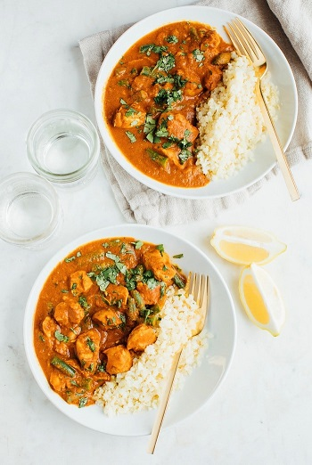

## Dairy-Free Butter Chicken

[Original Recipe by : Brittany Mullins](https://www.eatingbirdfood.com/slow-cooker-dairy-free-butter-chicken/)

** Prep time: 10 minutes || Cook time: 50 minutes || Total time: 1 hour || Serving: 4 || Rating ?/10 **

### Ingredients

- 2 lb boneless, skinless chicken breasts, chopped into 1 inch cubes
- 2 x 15 oz can full fat coconut milk
- 15 oz can tomato sauce
- 2 Tablespoons lemon juice
- 2 Tablespoons Coconut Oil
- 1 yellow onion, chopped
- 5 cloves garlic, minced
- 1 inch of ginger, grated
- 2 teaspoons ground turmeric
- 1 Tablespoon garam masala
- 1 Tablespoon cumin
- 1 teaspoon chili powder
- 1 teaspoon sea salt
- 1/2 teaspoon ground pepper
- 1/2 teaspoon cayenne (optional)
- 1/2 teaspoon ground cinnamon
- 1/4 cup chopped cilantro (optional - for serving)

### Instructions

1. Add oil to a large skillet and cook onion and garlic until soft and fragrant, about 5 minutes. 
2. Add fresh ginger, turmeric, garam masala, cumin, chili powder, salt, pepper, cinnamon and cayenne and toss to combine. Cook for another 1-2 minutes.
2. Add chicken, coconut milk, tomato sauce, lemon juice and mix well. Cover over medium-high heat and let it cook for about 15 minutes or until the chicken is cooked through.

### Notes
- You can cook:
	- In the instant pot: Cover, press manual for 20 minutes.
	- In the slow cooker: Cover and cook on high for 3 hours or low for 6 hours.

Serve over coconut rice, cauliflower rice, quinoa or barley with fresh cilantro and a wedge of lemon for squeezing.
