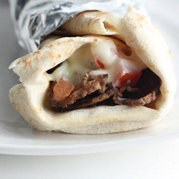

## Donair

[Original Recipe by Del](https://www.allrecipes.com/recipe/211191/the-original-donair-from-the-east-coast-of-canada/)

[Original Recipe by Heather](http://mmmisformommy.com/2011/12/donairs-halifax-classic.html)

** Prep time: 10 minutes || Cook time: 1 hour || Total time: 1h10 minutes || Serving: 6 || Rating 10/10 **

### Ingredients

- 1 pound ground chicken/beef
- Spice mixture: 
	- 1 teaspoon paprika
	- 2 teaspoons cayenne pepper
	- 1 teaspoon dried oregano
	- 1 teaspoon onion powder
	- 1 teaspoon garlic powder
	- 1 teaspoon salt	
	- 1 teaspoon ground black pepper

TO SERVE WITH (Optional)

- 6 large pita bread rounds
- donair sauce
- Tomato
- Lettuce

### Instructions

#### Donair

1. Take 2 legs and 2 thighs with the skin of the whole chicken, 
2. Grind it once with the meat grinder plate with the smallest screen.
3. Put the ground meat in the food processor and process it for about 30 seconds and add the spices mixture. Process it until it become a paste.
4. Put the paste meat into a loaf pan. Press the meat down.
5. Refrigerate overnight or at least 4 hours (best overnight).
6. Preheat the oven at 375F.
7. Bake until ready in about 20-25 minutes (Thermometer should be around 170F).
8. Take it out and let it rest for 10 minutes.

### Donair Sauce 

### 1. Classic Donair Sauce (Dairy or Dairy-Free)

** Ingredients **

- 1 (12 ounce) can sweetened condensed milk or Non-Dairy Sweetened Condensed Coconut Milk
- 1-2 teaspoons garlic powder
- 1/3 cup white vinegar, or to taste (add one tsp at a time)

** Instructions **

Mix the three ingredients together.

### 2. Dairy-free Navy Bean Donair sauce

[Original Recipe by Mrs. Latter](http://atlanticcanadianfoodie.blogspot.com/2016/12/dairy-free-donair-sauce.html)

** Ingredients **

- 1 cup/1 14 oz. can full-fat coconut milk, 
	- for best result chilled the can overnight in the refrigerator
- 1/4 cup sugar (honey, maple, sugar cane etc.)
- 1/4 cup cooked white navy beans
- 1 clove garlic
- 2-3 teaspoon apple cider vinegar
- 1 teaspoon salt

** Instructions **

1. For best result chilled the coconut milk can overnight in the refrigerator to separate the fat from the liquid. By only using the coconut fat, the sauce will be thicker 		otherwise it will still be good but runny. 
2. In a small pot over medium heat, mix in the fat of the coconut milk (which should be at the top of the can), sugar, and garlic. 
3. Bring to a simmer and add vinegar and beans and cook for about 5 minutes. 
4. Puree mixture with a blender or hand blender and if needed return to burner to thicken further. 
5. Season with salt to taste.

