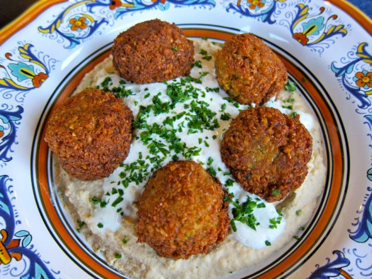

## Traditional Falafel

[Original Recipe by Tori's Kitchen](https://toriavey.com/toris-kitchen/falafel/)

** Prep time: 12 hours || Cook time: 40 minutes || Serving: 6 || Rating 10/10 **

** Ingredients **

- 1lb dry chickpeas - you must start with dry, do NOT substitute canned (see notes) 
- 1 small onion, roughly chopped
- 1/4 cup chopped fresh parsley
- 3-5 cloves garlic (roasted garlic cloves)
- 1 1/2 tablespoons chickpea flour
- 1 3/4 teaspoons salt
- 2 teaspoons cumin
- 1 teaspoon ground coriander
- 1/4 teaspoon black pepper
- 1/4 teaspoon cayenne pepper
- Pinch of ground cardamom
- Vegetable oil for frying (alternative: grapeseed, sunflower, avocado, canola etc.)

** Instructions **

1. Pour the chickpeas into a large bowl and cover them by about 3 inches of cold water. Let them soak overnight. 
2. Drain and rinse the chickpeas. 
3. Add them into your food processor along with the chopped onion, garlic cloves, parsley, flour, salt, cumin, ground coriander, black pepper, cayenne pepper, and cardamom.
4. Pulse all ingredients together until a rough, coarse meal forms. Process till the mixture is somewhere between the texture of couscous and a paste.
5. Place the mixture in a bowl and use a fork to stir. Remove any large chickpea chunks that the processor missed.
6. Cover the bowl with plastic wrap and refrigerate for 1-2 hours.
7. Fill a skillet with oil to a depth of 1 1/2 inches. Heat the oil slowly over medium heat until it reaches between 360 and 375 degrees F. 
8. Form falafel mixture into round balls using about 2 tablespoon of mixture per falafel. 
9. Fry the falafels in batches of 5-6 at a time till golden brown on both sides. 

### Falafel Variations :

** - SESAME FALAFEL: **

- After forming the balls, dip them in sesame seeds prior to frying (give a crunchier and nutty flavor falafel).

** - HERB/GREEN FALAFEL: **

- Add 1/2 cup additional chopped green parsley, or cilantro, or a mixture of the two prior to blending.

** - TURMERIC/YELLOW FALAFEL: **

- Add 3/4 teaspoon turmeric to the food processor prior to blending.

** - EGYPTIAN FAVA BEAN FALAFEL: **

- Use 1lb. dried fava beans instead of chickpeas (or a mixture of both equalling to 1lb); soak them in water for 24 hours, then drain, rinse and peel them. 
- Add the Classic Falafel ingredients to the processor along with the following ingredients – 1 chopped leek, 1/4 cup chopped dill, 1/4 cup chopped cilantro; and an additional 3/4 teaspoon cayenne pepper. 
- When mixture is processed to a coarse meal, pour into a bowl. Stir 2 1/2 tablespoons sesame seeds into the mixture with a fork until it’s evenly dispersed throughout the mixture. 
- Refrigerate. 
- Form falafel mixture into balls. If mixture seems too “wet” when making the falafel balls, add additional flour by the teaspoonful until the mixture sticks together better.
- proceed with frying.

### Falafel Topping Additions : 

- Pita bread 
- Falafel
- Tahini sauce
- Shredded lettuce
- Tomatoes
- Israeli salad
- Onions
- Dill pickles
- Hummus
- Tabbouleh

** Less traditional additions:**

- Sprouts
- Cucumber slices
- Roasted peppers
- Roasted eggplant slices
- Sunflower seeds
- Feta cheese
- Yogourt
- Tzatziki
	
** Two ways to prepare your pita: **

1. Cut the pita pocket bread in half to form two “pockets.” Each pocket is a serving size. Stuff the pocket with ingredients.
2. Separate the two layers of the pita into two single round layer. Overlap half of one layer over the second layer. Add your ingredients and then the falafels. Squished the falafel. Roll your pita. 
 
### Notes
- Makes 30-34 falafel balls. Serving size is roughly 5 falafels each. 
- To make falafel, canned will not work since it need to be uncooked to be able to hold it together. Canned beans are already soaked and cooked so it will become mush.

