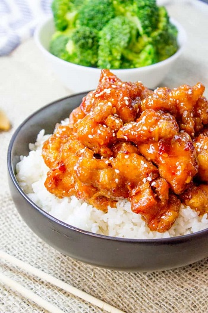

## General Tao Chicken

[Original Recipe by The Search for General Tso](http://www.thesearchforgeneraltso.com/tso/recipe.html)

[Picture link](https://dinnerthendessert.com/general-tsos-chicken/)

** Prep time: ? || Cook time: ? || Serving: 6 || Rating 10/10 **

### Ingredients

- 1 pound boneless chicken thighs, chopped into 1 inch pieces (breast chicken is fine as well. You can keep the skin on.)
- 1 egg
- 2 tablespoons soy sauce, divided (1 tbp for the marinade & 1 tbp for the sauce)
- 1 tablespoon tomato paste
- 1 tablespoon rice vinegar
- 1 teaspoon sesame oil
- 1 teaspoon of honey (Not traditional, optional)
- 1 teaspoon of corn starch (for the chicken pieces)
- 1 1/4 cups corn starch (for the sauce mixture)
- 1/4 cup Chicken Stock
- Dozen dried whole red chilies, halves (remove seeds if don't want too spicy)
- Dash of chili paste or hot sauce (to taste)
- 1 tablespoon peanut oil
- 2 cloves of garlic, minced
- 1 tablespoon ginger, minced
- Orange zest (optional
- Sesame Seeds (optional)
- canola oil, for deep-frying

### Instructions

1. Prepare the chicken pieces: 
	1. Into a big bowl make the marinade: stir in the egg and 1 tablespoon soy sauce.  
	2. Add the chicken pieces into the marinade bowl and coat them.
	3. Remove the chicken from its marinade and toss it in a bowl with 1 teaspoon of corn starch for coating.
	4. Heat up the cooking oil in the wok in medium high-heat. 
	5. Fry the chicken in batches, ready when golden. Remove and drain on a wire rack over some paper towels. 
	6. Pour the oil off into another container and save for subsequent batches. Wipe the wok with a paper towel.

2. Prepare the sauce: 
	1. In a small bowl, mix up the sauce: 1 tablespoon soy sauce, tomato paste, rice vinegar, Chicken Stock, sesame oil, honey (optional), 1 1/4 cups corn starch.
	2. In the wok, add peanut oil, chilis and stir fry for 10 seconds on medium-heat. 
	3. Add garlic and ginger. Stir fry for 15-20 seconds. 
	4. add the sauce mixture and stir it up for a minute or so.

3. When the sauce is looking gooey, add the chicken and mix it in to coat.

4. Add any optional ingredients if needed. 

Serve it over rice

