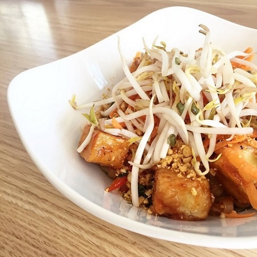

## General Tao Noodle Bowl

[Original Recipe from Pure Kitchen](https://www.purekitchenottawa.com/blog/generaltaonoodle)

** Rating 9.5/10 **

### Ingredients

- 8 oz General Tao sauce (recipe below)
- 10 oz rice noodle 3mm, soaked for 1 hour
- 4 pieces ginger lime tofu (recipe below)
- 2 cups collard green, cleaned destemmed and chopped
- 2 red/yellow bell peppers, chopped
- 1 medium onion, chopped
- 1 cup shredded carrot
- 1 cup bean sprouts
- 2 tbsp sesame seeds toasted
- Sunflower oil

### Steps

1. Bring a pot of water to a boil. Drop the noodles into the water for about 1-2 minutes. Remove from water using a strainer.
2. In a medium-large pan, heat oil.
3. Add the onions and peppers and saute for about 2 mins, then add the collard greens and carrots and cook for another 2 minutes until veggies are slightly tender.
4. Create a bowl and mix with noodles, tofu slices, veggies and sauce.
5. Garnish with bean sprouts and sesame seeds in the centre of the bowl. 

**Tip** You can substitute the vegetables here with any of your favourite vegetables, and add toasted nuts or any other protein source of your choice!

### General Tao Sauce

Yield: **4 cups** (This seem right amount of sauce for this recipe)

Cook Time: **5 – 10 minutes** (needs to be watched while cooking)

- 1 cup ketchup
- 1/2 cup tamari
- 1/2 cups water
- 1/2 cup maple syrup
- 3 1/2 Tablespoon mirin
- 2 Tablespoon sesame oil
- 1 ½ Tablespoon rice vinegar
- 1/3 teaspoon black pepper
- 1 ½ teaspoon sriracha
- 1 ½ teaspoon ginger, minced
- 1 ½ teaspoon garlic, minced

#### For the slurry:

- 3 Tbsp. cornstarch
- 3 Tbsp. water

####
1.   Combine all of the ingredients in a pot, except for the slurry ingredients. Bring the sauce to a boil, stirring continuously. **Do not leave unattended! The sugar can burn easily!**
2.   Mix the slurry ingredients in a bowl. Keeping the heat on medium high, mix the slurry into the sauce in the pot. Keep stirring the sauce over medium high heat until the mixture bubbles and thickens and the slurry is no longer cloudy in the sauce. The finished sauce should be glossy and thick enough to coat a spoon.

### Ginger Lime Tofu

**Yield: **1 Litres

**Prep Time: **30** **minutes

- 1 block firm tofu, water drained from package (we use locally made and GMO free La Soyarie tofu!)
- ¾ cup + 2 tbsp lime juice
- 6 tablespoons Sriracha
- ½ cup + 2 tablespoon tamari
- 6 ½ tablespoons agave
- 1 tablespoon garlic, minced
- 1 tablespoon ginger, minced
- 1 teaspoon salt
- ½ teaspoon Pepper
- ½ cup + 2 tablespoon sunflower oil
- ½ cup + 2 tablespoon water

####

1. Pressed the tofu to extract extra water (make it extra firm)
2. Combine all ingredients in a bowl and mix well with a whisk.
3. Cut the block of tofu into 10ish slices. Place the tofu into the marinade and let rest for at least 1 hour.
4. Lay tofu slices out onto a parchment lined baking sheet and pour a small amount of the marinade over the tofu.
5. Bake at 350 for 20-30 minutes, until most of the marinade has been baked into the tofu and it has darkened slightly.

_Tags: Vegan, main_