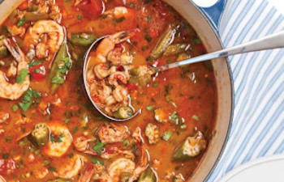

## Gumbo (Chicken or Shrimp)

** Prep time: 20 minutes || Cook time: 1 hour || Serving: 6 || Rating 10/10 **

### Ingredients

- 1 pounds of chicken breast (about 1 inch cubes) or shrimps (peeled and deveined)
- 4 Italian sausages (slices)
- 2 green bell peppers, chopped
- 2 stalks of celery, chopped
- 2 onions, chopped
- 8 ounces frozen or fresh okra
- 1 can whole tomatoes (28 ounces)
- 1 1/2 chicken bone broth
- 3/4 cup flour
- 3/4 cup olive oil
- 2 tablespoons Louisiana spice blend
- 1 bay leave
- salt and pepper

#### Homemade Louisiana spice blend:

- 3 tablespoons paprika
- 2 tablespoons onion powder
- 2 tablespoons garlic powder
- 2 tablespoons dried oregano
- 2 tablespoons dried thyme
- 2 tablespoons sassafras (gumbo file powder)
- 1 tablespoon of cayenne pepper

Mix well and store in a tightly sealed jar.

### Instructions

1. In a large soup pot, heat the oil over medium-high heat. 
2. When the oil is hot, gradually whisk in the flour, forming a 'roux'. Continue stirring the roux, whisking constantly until it begins to deepen in colour. 
3. When the roux is deep golden brown, add the onions, bell peppers and celery. Cook for a few minutes until softened. 
4. Add the broth and stir until thickened. 
5. Add the sausage, chicken/shrimp, tomatoes, okra, spice blend, bay leave, salt and pepper. 
6. Simmer at low heat until the sausage and chicken/shrimp are cooked through. 
7. Adjust the seasoning to your taste. Adjust the thickness by either adding more broth or boiling liquid of the gumbo, not runny or too thick.

Serve by itself or over [dirty rice](../sides/dirty_rice.md) or other type of rice.

