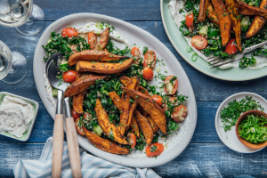

## Honey Roasted Sweet Potato Mezze Platter over Labneh & Tabouleh

Original Recipe by GoodFood

** Prep time: 15 minutes || Cook time: 30 minutes || Serving: 2 || Rating X/10 **

### Ingredients

- 140g Cherry tomatoes
- 1 Bunch of parsley
1 Scallion
1 Cucumber
½ Bunch of kale
450g Sweet potatoes 
 15ml Red wine vinegar
14g Honey
95g White quinoa
100ml Labneh
- [tabouleh](../../salad/tabouleh/)
15g Sumac & Garlic spice blend (dried vegetables, salt, spices, mustard, sugar, sunflower oil, lemon oil, sumac, garlic) 

### Instructions

1. 
Roast the sweet potatoes
Preheat the oven to 450°F. Cut the sweet potatoes lengthwise into ½ inch wedges. On a lined sheet pan, toss the sweet potato wedges with a drizzle of oil; season with ⅓ of the spice blend. Arrange in a single, even layer and roast in the oven, 22 to 24 minutes, flipping halfway through, until browned and tender when pierced with a fork. Remove the sheet pan from the oven and switch the oven to broil; drizzle the sweet potatoes with ⅔ of the honey. Return to the oven and continue to cook, 2 to 3 minutes, until browned.

2. 
a picture
Cook the quinoa
While the sweet potatoes roast, thinly slice the scallion, separating the white bottom and green top; discard the root end. In a medium pot, heat a drizzle of oil on medium-high. Add ½ the white bottom of the scallion and cook, stirring, 30 seconds to 1 minute, until fragrant. Add the quinoa (rinse before adding), 1 cup water (double for 4 portions) and a pinch of salt; bring to a boil. Reduce the heat, cover and simmer, 14 to 16 minutes, until the quinoa is tender. Fluff the cooked quinoa with a fork; season with ½ the remaining spice blend.

3. 
Mise en place
While the quinoa cooks, halve the cherry tomatoes. Medium-dice the cucumber. Strip the kale leaves off the stems, discarding the stems; thinly slice into ribbons, and place in a large bowl. Finely chop the parsley leaves and stems. In a medium bowl, make the vinaigrette by combining the red wine vinegar, ⅓ of the parsley, the remaining honey and 1 tbsp olive oil (double for 4 portions); season with S&P to taste. In another medium bowl, make the seasoned labneh by combining the labneh and remaining spice blend; season with S&P to taste. Stir to combine.

4. 

Make the kale-quinoa tabbouleh
To the bowl of kale, add a drizzle of olive oil; season with S&P to taste. Using your hands, massage the kale, 1 to 2 minutes, until softened. Add the cooled quinoa, tomatoes, cucumber, ½ the remaining parsley and as much of the remaining white bottom of the scallion as you’d like. Add the vinaigrette and season with S&P to taste. Toss well.

5. 
Plate your dish
Divide the seasoned labneh between your plates and spread in a circular motion. Top with the sweet potato wedges and tabbouleh. Garnish with the remaining parsley and as much green top of the scallion as you’d like. Bon appétit!

