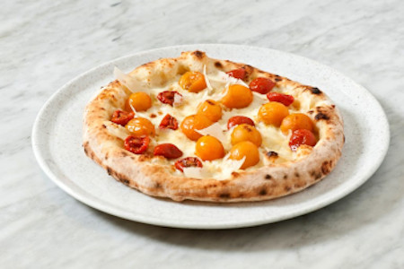

## Italian Pizzas

[Original Recipe by Franco Pepe](https://www.greatitalianchefs.com/recipes/cheese-and-tomato-pizza-recipe)

### 1. 'Tomato whim' – cheese and tomato pizza

** Prep time: XX minutes || Cook time: XX minutes || Serving: X || Rating X/10 **

#### Ingredients

- 250 grams of pizza dough (see authentic pizza dough recipe)
- 80g of Grana Padano, 24 months old
- 85g of buffalo mozzarella
- baby plum tomatoes, yellow
- sun-dried tomatoes, preferably San Marzano 

#### Instructions

1. If making at home without a pizza oven, preheat a fan oven to 250°C
2. Stretch and shape one 250g ball of pizza dough into a disc, leaving the edges slightly thicker than the centre
3. Evenly distribute the mozzarella and Grana Padano all over the pizza
4. Arrange some sun-dried tomatoes and yellow plum tomatoes over the surface of the pizza and cook in the oven for about 90 seconds (or in the fan oven for 6–7 minutes) 
5. Remove from the oven, drizzle over some extra virgin olive oil and serve with some more shavings of Grana Padano 
