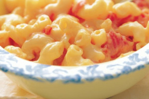

## Ultimate Mac and Cheese

[Original Recipe](https://dairyfarmersofcanada.ca/en/canadian-goodness/recipes/ultimate-tomato-macaroni-cheese)

** Prep time: XX minutes || Cook time: XX minutes || Serving: X || Rating X/10 **

### Ingredients

- 3 cups macaroni
- 1 tablespoon butter
- 1 finely chopped onion
- 1/4 cup all-purpose flour
- 3 cups (750 mL) Milk heated
- 1 teaspoon Dijon mustard
- 2 cups shredded Canadian old Cheddar cheese
- 1/4 cup freshly grated Canadian Parmesan cheese
- handful cherry tomatoes, halves
- 1/4 cup of fresh basil, chopped (optional)
- salt and  pepper

Optional add-on (at step 4)
- Pan-fry broccoli, bite pieces
- Leftover green bean casserole 
- Sausage

### Instructions

1. Cook macaroni according to package directions; drain well.
2. At 400C roasted the cherry tomatoes on a baking sheet for 20 minutes or until the tomatoes are shrivel and turning golden brown. 
3. Meanwhile, in heavy saucepan, melt butter over medium heat; cook onion until softened. Add flour and cook, stirring, for 1 min without browning. Gradually whisk in milk until smooth; whisk in mustard. Cook, stirring often, for 10 to 12 min or until thickened (do not boil).
4. Remove from heat; stir in Cheddar and Parmesan cheeses until melted. Add the roasted tomatoes and basil. and stir into sauce along with salt and pepper. 
5. Pour over macaroni and toss to coat.

Serve warm. 

Tips: 

